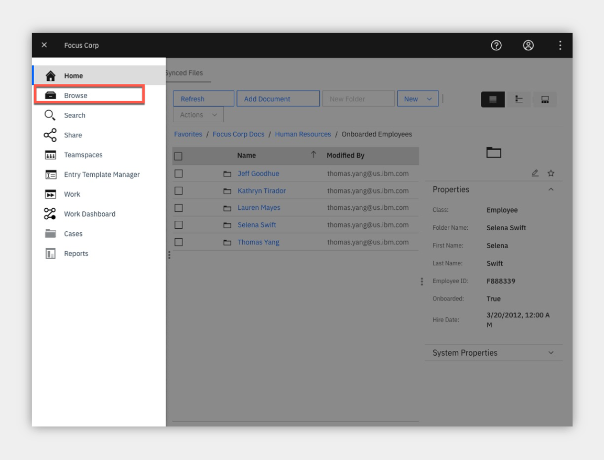

### an IBM Cloud Pak for Business Automation entry point

<AnchorLinks>
  <AnchorLink>Introduction</AnchorLink>
  <AnchorLink>Getting Started Lab</AnchorLink>
  <AnchorLink>Full Demo Narration</AnchorLink>
  <AnchorLink>Techincal Labs</AnchorLink>
</AnchorLinks>

***

# Introduction

**Entry Point:** Enable secure, compliant content access with content services

**Use Case Overview:** Focus Corp must collaborate both internally and externally during the employee onboarding process as well as enforce structured and adhoc workflows. 

Focus Corp accelerates the use of unstructured content in an employee onboarding use case using teamspaces and secure external file sharing. You will assume the role of Lucy, an HR employee onboarding specialist at Focus Corp. Lucy’s objective is to improve Focus Corp’s process and ensure various onboarding requirements are met in a secure, structured, consistent and timely manner to onboard the new employees.

**Choose an option:**

  * **Digital Business Automation on Cloud trial:** your environment is predeployed, continue to the [Getting Started Lab](#getting-started-lab) section below.
  * **Install Yourself:** To deploy Onboarding Automation on your own environment, and technical architecture information, see the <a href="https://github.com/ibm-cloud-architecture/dba-onboarding-auto.git" target="_blank">dba-onboarding-auto</a> git repository which includes the required deployment artifacts.

 

***

# Getting Started Lab

## Are you ready to enable secure, compliant content access with content services?

1 - Scenario Introduction - Automation Onboarding

<Row>
<Column colLg={5} colMd={5}>

**Demo Video**

<ArticleCard
    color="dark"
    title="Demo Video - Onboarding Automation"
    subTitle="In this demo, you will learn how to use content services to manage employee onboarding"
    href="https://ibm.biz/cp4ba-shared-services-video"
    actionIcon="arrowRight"
    color="dark"
    >

</ArticleCard>
</Column>
<Column colLg={7} colMd={7}>

**Demo Outline**

[Full Demo Narration](#full-demo-narration)

1. Use Case Overview
1. Focus Corp Demo Dashboard review
1. Onboarding Specialist persona
    1. IBM Navigator Tour
    1. Review Teamspace
    1. View and Edit Documents
    1. Review Video Bookmakrs
    1. Launch Onboard Process
1. Use case review and value of content services

 

</Column>
</Row>
<Row>
<Column colLg={4} colMd={4}>

**Discovery Map**

 

</Column>
<Column colLg={6} colMd={6}>

 

</Column>
</Row>

[Go to top](#introduction) | [Go to Getting Started Lab](#getting-started-lab)

2 - Login and Setup Your Environment

 

Option 2A - Are you using a Digital Business Automation on Cloud Trial or Demo Environment?

 

1. Login to your Digital Business Automation on Cloud trial or demo <a href="http://automationcloud.ibm.com" target="_blank">here</a> to access your portal.
1. Administrator Users, expand the following section to access additional steps to setup access for yourself and others in your environment:

 

Additional on Cloud Administrator Setup

1. Open the menu in the upper left.
1. Under **Administer subscriptions**, click **Access management**.
1. Locate or search for your user and ensure all environments (Development and so on) are activated.
1. Click the pencil icon on the right side of your user row and ensure the required roles are selected (below is an example set of roles for a user to access all capabilities).
1. Optionally, add all administrator roles as appropriate (below for reference).

 

<Row>
<Column colLg={4} colMd={4}>

**All User Access Roles**

 

</Column>
<Column colLg={4} colMd={4}>

**All Administrator Roles**

 

</Column>
</Row>

 

 

3. Standard Users, once your administrator (either trial or demo admin) completed setup of your access, please continue.
4. Open the Focus Corp Demo Dashboard
    1. Open the menu in the upper left
    2. Select **Production** and then **Run**
    3. Click the **Process Portal** tile
    4. Wait for the portal to load in a new browser window/tab

     

    5. On the left menu, under the **Dashboards**, click **Show more/less…**
    6. Click **Focus Corp Demos Dashboard**
    7. Wait for the dashboard to load on the right

     

    8. Start by reviewing the available demos, they all represent an entry point to business automation so you can easily get started.
     

     

     

    9. When ready, click the green **Onboarding Automation** button to launch the demo.

     

     

    10. Check the tabs to learn more about the demo
        1. **Storyboard**
        1. **Discovery Map**

     

    11. Navigate to the **Run the demo!** tab and then click on the picture of the **Lucy - HR Employee Onboarding Specialist**

     

 

Option 2B - Are You Using Your Own Environment (not an on Cloud trial/demo)?

 

1. Ask your administrator for the URL to Workplace (or the Navigator desktop for Workplace) and the login credentials.
1. Log in to the URL provided
1. Please continue to the next section

 

 
 

[Go to top](#introduction) | [Go to Getting Started Lab](#getting-started-lab)

3 - Tour IBM Navigator

#### IBM Navigator is a desktop for an organization's workers to find and organize information.

 

You are now a Human Resources (HR) Onboarding specialist (Lucy) at Focus Corp reviewing an applicant (John Doe) for employment. As an onboarding specialist, Lucy will use the IBM Navigator user interface to review content submitted by John such as the employment application and interview video.

 

Let's take a quick tour of the **IBM Navigator** user interface.

 
 

Open the Onboarding Automation app which opens the **IBM Navigator** user interface

 

At the top of the interface, we see a configurable banner with a hamburger icon to access Navigator Features such as **Browse**, **Search**, **Share**, **Teamspaces**, **Workflow** and **Records Management**.  Additional features can also be added using plugins.

 

Select the **Browse** feature.

 

 

 

We are currently viewing a repository called **Corporate Operations** which is an **IBM FileNet Content Manager** repository. We can also access other repositories and perform cross-repository searches using **CM8**, **CMoD**, **Box** and **CMIS** (Content Management Interoperability Services) compliant repositories like **Alfresco** and **Microsoft SharePoint** On-Premises.

 

 
 

Select the **Focus Corp Docs - Human Resources – Onboarded Employees** folder representing content that we have for employees that have already been onboarded.  For onboarded employee – **Selena Swift**, we can see custom folder properties such as the **First Name**, **Last Name**, **Employee ID**, **Onboarding** status and **Hire Date**.

 

In our example, Focus Corp maintains an **Employee Packet** folder that contains new employee info documents such as the **Confidentially Agreement** and **Employee Manual**.  In the **Details** view, we are able the thumbnail and properties of the selected content.
When we switch over to the **Magazine** view, we can now we see the same content along with social features such as **Likes**, **Tags**, **Downloads** and **Comments**.  We also have a **Filmstrip** view that’s very useful for looking at media such as these pictures in the **Photos** folder.

 

 

 

Continue to explore the **IBM Navigator** interface.

 

[Go to top](#introduction) | [Go to Getting Started Lab](#getting-started-lab)

4 - Review Teamspaces

 

To start using Workplace, your administrator must first assign you, and any of your colleagues, a workstreams team which controls access in the Workplace environment.

 

1. Click the menu grid icon in the upper right corner.
2. If you see **Create workstreams** you have been given the required access to continue (Note, if you do not see this menu option, close the menu, wait 5-10 seconds and try again)

 

 

3. If you do not have **Create workstreams** in your menu, contact your administrator and ask for the Configurators workstream team to be added and be sure to refresh your browser window to make it effective.
4. Administrator Users, expand the following section to access additional steps to setup access for yourself and others in Workplace:

 

Additional Workstreams Administrator Setup

 

1. Click the menu grid icon in the upper right corner and select **Manage workstream teams**.
2. Click the radio button to the left of **Administrators** and wait for the right side list to load, which may be empty.

 

 

3. Click the plus sign in the right side to search for and add a new user to the team.  It is recommended to add yourself to **Administrators** and **Configurators** and optionally **Team managers**.

 

 

4. Optionally, create a new team named **Shared Services** and add yourself to represent assigning work to your team.
5. **IMPORTANT**: now that you have the correct teams set, refresh your browser window/tab to make the roles effective.
6. You will know once the role is effective when you click the menu grid icon in the upper right corner and see the following options.

 

 

 

[Go to top](#introduction) | [Go to Getting Started Lab](#getting-started-lab)

5 - View and Edit Documents

 

As a Supervisor, you are now ready to create a new workstream and publish it so the departments you work with, such as Accounts Payable and HR, can submit their requests in an organized manner.

 

1. Click the menu grid icon in the upper right corner and select **Create workstreams**

 

 

2. Review the workstreams provided with the platform as examples that you can keep or edit or wait and review once you create your own workstream.
3. Once done reviewing, click the blue **New** button and configure your definition as pictured below, then click **Next** when ready.

 

> NOTE: selecting **All users** will allow any user in the system to submit a new request to your team; this could also be restricted to a team that you create, if desired.

 

4. Review the workstream editor:
    1. Your workflow will show vertically on the left.
    1. The currently selected activity in your workflow is configurable on the right.
    1. A draft can be saved at any time
    1. The Save button will place the workflow in trial mode for testers to try out.
5. Name the first activity **Skill profile** and select **Checklist** as the type.

 

 

 

6. Scroll down on the right side to configure your workflow's first activity
    1. Add some checklist items.
    1. Select **Allow users to update the checklist at start** (it might make sense to use placeholders as depicted below).
     
    1. Activate the data items slider, click **Select data items**, click the plus sign and add two data items as pictured below.
    1. Select each data item and **Add selected items**.
     
    1. Click **Who is responsible for this activity** and choose either **Shared Services**, if you created that optional team and added yourself, or **All users**.  Note, if you leave this screen to go check the teams, be sure to save a draft first.
     

 

7. When you are done and ready to create your second activity, you can either:
   * click the plus icon at the bottom, or
   * scroll to the top and click the plus icon in the left side flow diagram.
8. Name the second activity **Approve Resource** and select **Approval** as the type.  This creates a two-way branch in the flow.

 

 

9. As above, click the plus sign next to **If approved** to add a third activity for that branch.
    1. Name the third activity **Approval Notification**
    1. Select **Form** as the type.
    1. Optionally click **Select data items** to add some data and select Read only.

 

 

10. In the left diagram, click the **Approve Resource** activity box, then click the plus sign next to **If rejected** to add a fourth and final activity for the other branch.
    1. Name the fourth activity **Denial Notification**
    1.  Select **Form** as the type.
    1. Optionally add data as Read only.
11. You may change the **Who is responsible for this activity** selection for the two notification activities to **The user who starts the workstream** and/or the approval activity to **Team managers** (just make sure you are a member of the selected team).

### Congratulations, you created your first lightweight workflow!  Anyone can submit and route a workflow to the Shared Services team who respond with their skills and an approval with a notification sent to the submitter with the response.

 
 

12. When complete, scroll to the top and click the blue **Save** button to put the workflow in trial mode

 

 

[Go to top](#introduction) | [Go to Getting Started Lab](#getting-started-lab)

6 - Launch Onboard Process

 

It is time to test your new workstream. There is a built-in Testers group that allows you to delegate this role but for now, let us test ourselves.

 

1. Click the menu grid icon in the upper right corner and select **Create workstreams**.
2. Locate the new workstream you just created and click the three-dot menu on the right, then select **Test**.

 

 

3. The initialization screen is specific to this workflow; read the instructions and scroll down to customize the checklist available to you as the workflow starter.  An example is below

 

 

4. Once ready, scroll to the top right and click the blue **Start workstream** button.
5. To test the first task as a Shared Services team member, click the menu grid icon in the upper right corner and select **Workplace**
6. You should see a **Skill profile** task in the list, click the name and claim it.

> Note: if you do not see the task in the list, you can either click the magnifying glass and search for `skill` or click the browser refresh button.  The task list may not refresh automatically in some browsers so searching should be faster than a full refresh.

 

 

7. You are now testing as a Shared Services resource on the team you lead.
    1. Check off the items in the checklist
    1. Fill in the data fields
    1. Optionally upload a document or picture to securely include in the request.
    1. Optionally add a comment.
    1. Submit the task.

 

 

8. Back at the task list, use the magnifying glass to search for **Approve Resource** and claim the task.

 

 

9. You are now the shared services team manager again, time to approve or decline the request.
    1. Review the approval screen.
    1. If you added data, it is read-only by default
    1. If you added comments in the previous task, they are present.
    1. Either **Reject** or **Approve** the request.

 

 

10. Back at the task list, use the magnifying glass to search for **Notification** and claim the task.

 

 

11. You are now the original submitter/requestor such as an Accounts Payable team member.
    1. Review the notification, including optional data and comments.
    1. When done, click **Complete** at the upper right.

 

 

[Go to top](#introduction) | [Go to Getting Started Lab](#getting-started-lab)

7 - Summary

 

As you saw, Workstream Services helps you manage remote work more effectively by allowing business users to create lightweight workflows that automate internal processes, no coding required. Get ready to improve your team's productivity by simplifying common tasks and decreasing the complexity and limitations of remote work.

 

[Go to top](#introduction) | [Go to Getting Started Lab](#getting-started-lab)

***

 
 

# Technical Labs

## Optional - additional features to explore

100 - Searching

#### Bold Text Here
 
 
 
 
 
 
[Go to top](#introduction) | [Go to Getting Started Lab](#getting-started-lab)

101 - Navigaor Edit Service

#### Bold Text Here
 
 
 
 
 
 
[Go to top](#introduction) | [Go to Getting Started Lab](#getting-started-lab)

102 - Navigator Sync Service

#### Bold Text Here
 
 
 
 
 
 
[Go to top](#introduction) | [Go to Getting Started Lab](#getting-started-lab)

103 - Navigator for Microsoft Office

#### Bold Text Here
 
 
 
 
 
 
[Go to top](#introduction) | [Go to Getting Started Lab](#getting-started-lab)

104 - Mobile Access - IBM Navigator Mobile App

#### Bold Text Here
 
 
 
 
 
 
[Go to top](#introduction) | [Go to Getting Started Lab](#getting-started-lab)

105 - Entry Templates

#### Bold Text Here
 
 
 
 
 
 
[Go to top](#introduction) | [Go to Getting Started Lab](#getting-started-lab)

106 - Parallel / Serial Workflow

#### Bold Text Here
 
 
 
 
 
 
[Go to top](#introduction) | [Go to Getting Started Lab](#getting-started-lab)

107- GraphQL

#### Bold Text Here
 
 
 
 
 
 
[Go to top](#introduction) | [Go to Getting Started Lab](#getting-started-lab)

108 - Navigator Administration

#### Bold Text Here
 
 
 
 
 
 
[Go to top](#introduction) | [Go to Getting Started Lab](#getting-started-lab)

901 - Integration - IBM Watson Discovery

#### Bold Text Here
 
 
 
 
 
 
[Go to top](#introduction) | [Go to Getting Started Lab](#getting-started-lab)

***

 
 

# Full Demo Narration

#### Intro

Working in a remote environment adds complexity to most tasks.  Imagine you lead a shared services team and receive requests from other departments such as Accounts Payable or HR. In person, it's simple to collect information and share status.

However, in a remote environment, organizing work is more challenging.  Relying on email and phone is just not enough. Work can be duplicated or executed inconsistently, resulting in lost data and delays.  You need a lightweight workflow to manage incoming requests.

#### Demo Start Page

After reviewing the demo launch page including the outline and discovery map, we are ready to launch the Line of Business Supervisor's Workplace interface, the single place you manage all your work.

#### Manage workstream teams

You check out the start workflow list and see great starting activities and workflows such as approval, checklist and more.

You start by managing the teams.  It's a good idea to add yourself to at least Administrators and Supervisors and maybe Team managers.  You can also create a Shared Services team so you can assign work to them later.

#### Create a workstream

Now it's time to create a workstream for incoming shared services requests.  We'll set it so everyone can start and give a description.  The simple, no-code editor allows you to assemble a workflow in just a few clicks.  Start with a checklist activity to represent the skill profile requested.  To make this reusable, we add checklist items with placeholders and allow the user that launches the flow to update and add more.  Let's also add a couple data items for the country and date available.  Once the request is submitted, the shared services team member will complete this form and confirm their skills.  Your first activity is complete!

We add another step to get manager approval and setup a simple branch flow.  For the approval branch we add a form to notify of the result.  Then, head back to our approval and add the rejection branch.  So simple!  To complete the workstream, we save and we're ready to go.

#### Test a workstream

The new flow starts in trial mode for the author or a testing group to try it out safely before the end users.  Simple to test, we see the launch screen specific to this workstream where the user starting the flow, such as an Accounts Payable clerk, will configure available options including checklist items, and also any activity assignments allowed by the workstream, which we did not activate yet.

Once started, we go back to the main Workplace.  Let's take on the role of a shared services team member and see how easy it is to complete the first step. Claim and open the task, check the checklist items, fill in the data, optionally attach a document for review, type a comment and submit.  This is much easier and more organized than email.  Now taking on my team manager role for approval, all looks good and I accept.  Finally, the original requestor receives an approval notification to complete the request. Back at the task list we can switch to workflows and without any customization, the tool provides a complete audit trail of all work by default.

#### Publish a workstream

Once ready, I can request a publish to share my workstream with other teams.  The platform has a built-in approval workstream for workstreams!  So we head to the same task list, click to review the workstream definition.  As a publisher, I may send it back with comments or publish directly.  And in just a few minutes, I created, tested and published a new, lightweight workflow available to anyone in my organization: ready to launch!

#### Use Case Summary

As you saw, Workstream Services helps you manage remote work more effectively by allowing business users to create lightweight workflows that automate internal processes, no coding required. Get ready to improve your team's productivity by simplifying common tasks and decreasing the complexity and limitations of remote work.

 

[Go to top](#introduction) | [Go to Getting Started Lab](#getting-started-lab)
