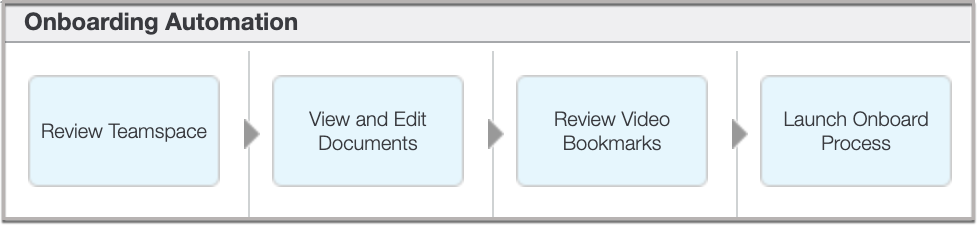
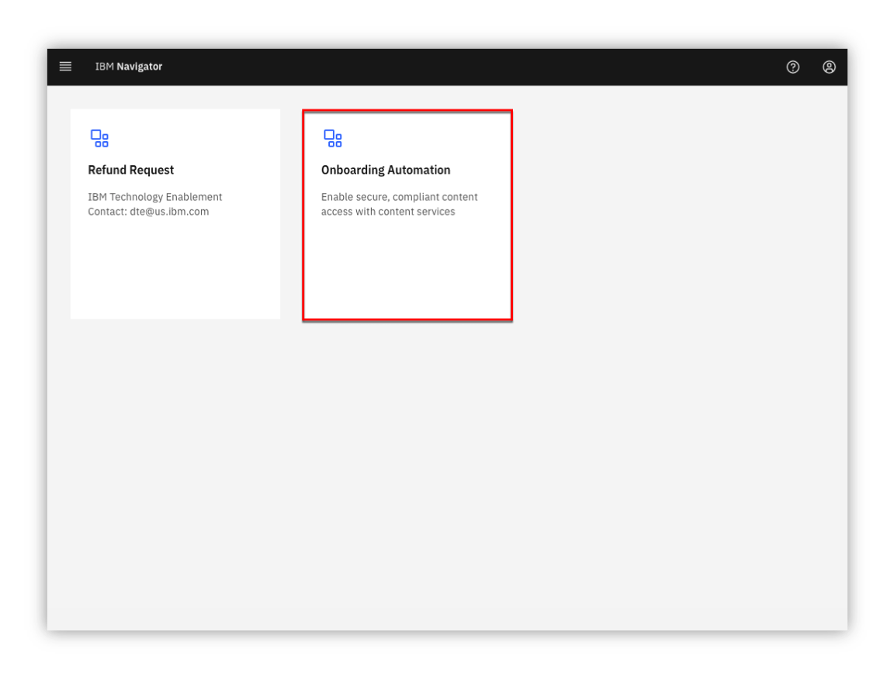
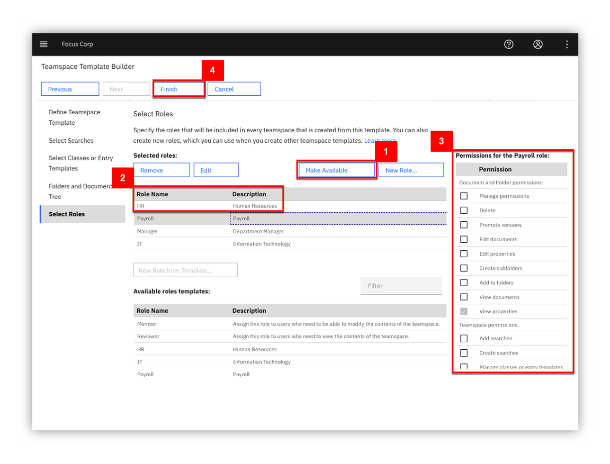
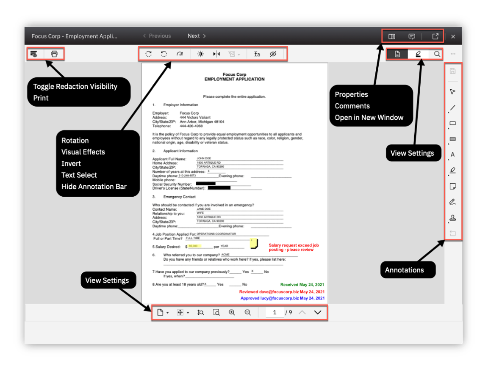
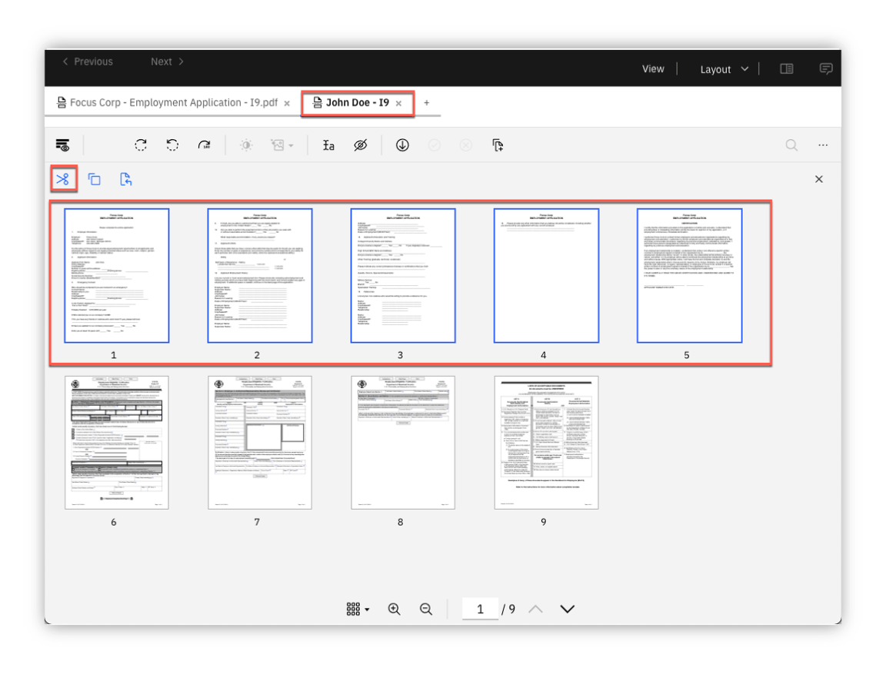

### an IBM Cloud Pak for Business Automation entry point

<AnchorLinks>
  <AnchorLink>Introduction</AnchorLink>
  <AnchorLink>Getting Started Lab</AnchorLink>
  <AnchorLink>Additional Assets</AnchorLink>
</AnchorLinks>

***

# Introduction

**Entry Point:** Enable secure, compliant content access with content services

**Use Case Overview:** Focus Corp must collaborate both internally and externally during the employee onboarding process as well as enforce structured and adhoc workflows. 

Focus Corp accelerates the use of unstructured content in an employee onboarding use case using teamspaces and secure external file sharing. You will assume the role of Lucy, an HR employee onboarding specialist at Focus Corp. Lucy’s objective is to improve Focus Corp’s process and ensure various onboarding requirements are met in a secure, structured, consistent and timely manner to onboard the new employees.

**Choose an option:**

  * **Digital Business Automation on Cloud trial:** your environment is predeployed, continue to the [Getting Started Lab](#getting-started-lab) section below.
  * **Install Yourself:** To deploy Onboarding Automation on your own environment, and technical architecture information, see the <a href="https://github.com/ibm-cloud-architecture/dba-onboarding-automation" target="_blank">dba-onboarding-automation</a> git repository which includes the required deployment artifacts.

 

***

# Getting Started Lab

## Are you ready to enable secure, compliant content access with content services?

1 - Scenario Introduction - Automation Onboarding

 

**Use Case Overview**

 

Employee applicant (John Doe) has submitted an employee application and interview video along with other materials as part of the employement application process.  During this process, HR processors have initially reviewed the employement application making comments and annotations on the document along with entering video bookmarks allowing additional reviewers to quickly locate key responses.  Lucy along with other reviewers are able to review all the information and documents pertaining to applicant John Doe in the **Teamspace** in a consistent and secure manner using an intuitive user-interface. Some of the information such as the applicant's SSN is available on some of the documents but they are redacted so that only reviewers with the approrprate permission are able to see the redacted content.  The use of video bookmarks also allows Lucy to quickly jump to key sections of the the video without necessarily having to watch the entire video.  Finally, we are able to integrate with **IBM Business Automation Workflow** to launch additional manual and automated processes.

 

**Discovery Map**

 

 

[Go to top](#lab-section-1) | [Go to Getting Started Lab](#getting-started-lab)

2 - Login and Setup Your Environment

 
 

Option 2A - Are you using a Digital Business Automation on Cloud Trial or Demo Environment?

 

1. Login to your Digital Business Automation on Cloud trial or demo <a href="http://automationcloud.ibm.com" target="_blank">here</a> to access your portal.
1. Administrator Users, expand the following section to access additional steps to setup access for yourself and others in your environment:

 

Additional on Cloud Administrator Setup

1. Open the menu in the upper left.
1. Under **Administer subscriptions**, click **Access management**.
1. Locate or search for your user and ensure all environments (Development and so on) are activated.
1. Click the pencil icon on the right side of your user row and ensure the required roles are selected (below is an example set of roles for a user to access all capabilities).
1. Optionally, add all administrator roles as appropriate (below for reference).

 

<Row>
<Column colLg={4} colMd={4}>

**All User Access Roles**

 

</Column>
<Column colLg={4} colMd={4}>

**All Administrator Roles**

 

</Column>
</Row>

 

[Go to top](#lab-section-2aa) | [Go to Getting Started Lab](#getting-started-lab)

 

3. Standard Users, once your administrator (either trial or demo admin) completed setup of your access, please continue.
4. Open the Focus Corp Demo Dashboard
    1. Open the menu in the upper left
    2. Select **Production** and then **Run**
    3. Click the **Business Automation Apps** tile to launch **Business Automation Navigator (BAN)****
    4. Wait for the **BAN** to load in a new browser window/tab
     

     

     

    5. Start by reviewing the available demos, they all represent an entry point to business automation so you can easily get started.
     

     

     

    6. When ready, click the green **Onboarding Automation** button to launch the demo.
     

     

     

    7. Check the tabs to learn more about the demo
        1. **Storyboard**
        1. **Discovery Map**

     

     

     

    8. Navigate to the **Run the demo!** tab and then click on the picture of the **Lucy - HR Employee Onboarding Specialist**
     

     

     

[Go to top](#lab-section-2a) | [Go to Getting Started Lab](#getting-started-lab)

 

Option 2B - Are You Using Your Own Environment (not an on Cloud trial/demo)?

 

1. Ask your administrator for the URL to IBM Business Automation Navigator and the login credentials.
1. Log in to the URL provided
1. Please continue to the next section

[Go to top](#lab-section-2b) | [Go to Getting Started Lab](#getting-started-lab)

 

[Go to top 2](#lab-section-2) | [Go to Getting Started Lab](#getting-started-lab)

3 - Tour IBM Navigator

#### IBM Navigator is a desktop for an organization's workers to find and organize information.

 

You are now a Human Resources (HR) Onboarding specialist (Lucy) at Focus Corp reviewing an applicant (John Doe) for employment. As an onboarding specialist, Lucy will use the IBM Navigator user interface to review content submitted by John such as the employment application and interview video.

 

Let's take a quick tour of the **IBM Navigator** user interface.

 

1. As shown in the diagram below is the **IBM Navigator** user interface.  At the top of the interface, we see a configurable banner with a hamburger icon to access the navigation menu to access features such as **Browse**, **Search**, **Share**, **Teamspaces**, **Workflow** and **Records Management**.  Additional features can also be added using plugins.  Select the **Browse** feature.

 

 

 

We are currently viewing a repository called **Corporate Operations** which is an **IBM FileNet Content Manager** repository. We can also access other repositories and perform cross-repository searches using **CM8** (IBM Content Manager), **CMOD** (IBM Content Manager OnDemand), **Box®** and **CMIS** (Content Management Interoperability Services) compliant repositories like **Alfresco® ** and **Microsoft SharePoint®** On-Premises.

 

3. Select the **Focus Corp Docs / Human Resources / Onboarded Employees** folder representing content for already onboarded employees.
Next, select the **Selena Swift** folder as shown in the diagram below.

 

 

 

For onboarded employee – **Selena Swift**, we can see custom folder properties such as the **First Name**, **Last Name**, **Employee ID**, **Onboarding** status and **Hire Date**.

 

4. Select the **Employee Packet** folder and then in the upper-right corner, select the different **Views** (**Details**, **Magazine**, **Filmstrip**).
Let's first select the **Details** view as shown in the diagram below.

 

 

 

In our example, Focus Corp maintains an **Employee Packet** folder that contains new employee info documents such as the **Confidentially Agreement** and **Employee Manual**.  In the **Details** view, we are able to see the thumbnail and properties of the selected content.

 

5. Select the **Magazine** view

 

 

 

In the **Magazine** view, we can now we see the same content along with social features such as **Likes**, **Tags**, **Downloads** and **Comments**.

 

6. Select the **Filmstrip** view.  The **Filmstrip** view is very useful for looking at media such pictures.  Select the **Photos** folder below the **Employee Packet** folder and then select each picture document.

 

 

 

[Go to top](#lab-section-3) | [Go to Getting Started Lab](#getting-started-lab)

4 - Teamspaces

#### Let’s now look at Teamspaces.  Teamspaces represent a focused view of the relevant folders, documents and searches that a team needs to complete their tasks.

 

Our use case scenario revolves around Lucy reviewing an existing teamspace for employee applicant John Doe.  Typicaly, the teamspace would have already been created, processed and reviewed by a few HR processors before reaching Lucy to further review and approve the applicant for onboarding.  In this section, we first create an employee onboarding teamspace for the employee applicant John Doe.  Next, we will review how a teamspace is used once it is created.

 

4.1 - Create Teamspace

 

An **Employee Onboarding** Teamspace Template should already be available.  If not or if you want to learn more about creating teamspace, please proceed to the next section below.  Otherwise, proceed to section **4.1.2 - Teamspace Builder**.

 

4.1.1 - Teamspace Template Builder

 

This section covers the creation of a teamspace template using the **Teamspace Template Builder**.

 

The use of **Teamspace Templates** allows for the configuration of the folder hierarchy, documents, search templates, and security in a user-friendly wizard interface which can then be used to create Teamspaces in a timely, secure and consistent manner.

 

1. From the navigation menu, click on **Teamspaces**

 

 
 

2. Click on the **Templates** tab and then click on **New Template**

 

 

As shown in the diagram below, the **Teamspace Template Builder** is displayed.

 

The teamspace template builder uses a wizard-driven user interface that guides you through the following steps:
- Define Teamspace Template
- Select Searches
- Select Classes or Entry Templates
- Folders and Documents Tree
- Select Roles

 

 

 
 

3. Teamspace Template Builder - Step 1 - Define Teamspace Template

 

Enter any value for the **Template name** and **Template description**.  If you are using a shared environment and plan to share the template, please select a value that distinguishes your template from others. In the diagram below, we entered a generic template name and description for our employee onboarding use case. For this template, we have specified not to share the template.

 

At this point, we can continue to the next step by clicking on the **Next** button for the remaining configuration items (searches, classes/entry templates, folders/documents and roles).  At any point, we can complete the configuration of the template by clicking on the **Finish** button and optionally edit the configuration at a later time.

 

When complete, click on the **Next** button to continue to the next step.

 

 

 
 

4. Teamspace Template Builder - Step 2 - Select Searches

 

Specifying a search name will allow members of the teamspace to use a saved search to easily find documents relevant to the teamspace project.  To add a search, specify a **Search Name** in the bottom list and then click the **Add** button. In the diagram below and in our main demo scenario, we have elected not to use a saved search.  When complete, click on the **Next** buton to continue to the next step.

 

 

 
 

5. Teamspace Template Builder - Step 3 - Select Classes or Entry Templates

 

This steps specifies either document classes or entry templates that can be used to store documents into the teamspace.  Configure this step using the class or entry template based on your use case.  As shown in the diagram below for our main demo use case, first click the option for **Use entry templates to add documents**.  Select the **Employee Onboarding - Application** and the **Employee Onboarding - Document** entry templates.  Finally, click on the **Add** button and then the **Next** button to continue to the next step.

 

Please note that the **Employee Onboarding - Application** entry template uses the **Employment Application** document class and the **Employee Onboarding - Document** entry template uses the default **Document** class.  If these entry templates are not available, either create them or simply select the other option of **Use classes to add documents** and specify the **Document** class and the **Employe Application** class.

 

 

 
 

6. Teamspace Template Builder - Step 4 - Folder and Documents Tree

 

This step configures the folder structure that should be used for the teamspace.  Additionally, documents can be added to the folder(s).  The use of a common folder structure and default documents provide a consistent process so that any teamspaces created with this template uses a consistent and standardized folder hierarchy and documents.

 

Click **New Folder** and then build the folder structure shown below or based on your demo scenario.  To add a document to a folder, click on the **Add Document** button and add a document.  When complete, click on the **Next** button to continue to the last step.

 

As shown in the diagram below, we have built the folder structure for the Automation Onboarding demo use case.

 

 

 
 

7. Teamspace Template Builder - Step 5 - Select Roles

 

This steps allows us to create any custom roles for the template which can also be shared with other templates.  Click on **New Role** and then specify the **Role name** and **Role description**.  Next, set the desired permissions on the role.  To share the role with other templates, click on **Make Available**.  Click on the **Finish** button to complete the setup of the teamspace template. The teamspace temlate can be updated at a later time if desired.

 

The teamspace template is now complete, please refer to the next section **Teamspace Builder** to create a teamspace from this template.

 

 

 

[Go to top](#lab-section-4) | [Go to Getting Started Lab](#getting-started-lab)

 

 

4.1.2 - Teamspace Builder

 

This section covers how to create a teamspace from the **Employee Onboarding Teamspace** template that was created in the section above.

 

Download the document below, we use this later to add the employment application document into the teamspace
* Employment Appplication - [Focus Corp - Employment Application.pdf](https://github.com/ibm-cloud-architecture/dba-onboarding-automation/raw/main/content-services/sample-documents/Focus%20Corp%20-%20Employment%20Application.pdf)

 

1. From the navigation menu, click on **Teamspaces**

 

 

2. Click on the **Teamspaces** tab and then click on **New Teamspace**

 

 

As shown in the diagram below, the **Teamspace Builder** is displayed.

 

Similiar to the **Teamspace Template Builder**, the **Teamspace Builder** uses a wizard-driven user interface that guides you through the following steps:
- Define Teamspace
- Select searches
- Select Classes or Entry Templates
- Folders and Documents Tree
- Select Users

 

 

 

3. Teamspace Builder - Step 1 - Define Teamspace

 

Enter any value for the **Template name** and **Template description**.  If you are using a shared environment, please select a value that distinguishes your teamspace from others. Next, select the **Employee Onboarding** template or the teamspace template that was created in the section above.

 

When complete, review the information after the diagram below and then click on the **Next** button to continue to the next step.

 

 

We can directly build the teamspace or we can specify the teamspace template that contains some pre-define configuration settings.  Using the template allows us to consistently build the teamspace ensuring the proper folder, documents, searches and roles are configured for every new project. At the same time, we are also able to slightly modify these settings as we create the teamspace for any additional configuration that may be needed for the specific teamspace.

 

At this point, we can continue to the next step by clicking on the **Next** button for the remaining configuration items (searches, classes/entry templates, folders/documents and roles).  At any point, we can complete the configuration of the template by clicking on the **Finish** button and optionally edit the configuration at a later time.

 

When complete, click on the **Next** button to continue to the next step.

 

4. Teamspace Builder - Step 2 - Select Searches

 

Any saved searches that were included in the teamspace template should be listed in the **Selected searches** area.  If desired, add any searches that you would like to be included in the teamspace.  When complete, click the **Next** button to continue to the next step.

 

 

5. Teamspace Builder - Step 3 - Select Classes or Entry Templates

 

This step identifies the classes or entry templates that were configured with the teamspace template.  Any document classes or entry templates that were included in the teamspace template should be listed in the **Selected Classes / Entry Templates** area.  If desired, add additional classes or entry templates that you would like to be included in the teamspace.  When complete, click the **Next** button to continue to the next step.

 

 

6a. Teamspace Template - Step 4a - Folders and Documents Tree

 

As shown below, the folder structure and associated documents were automatically created based on the teamspace template. In this step, we will add the [Emmployment Application](https://github.com/ibm-cloud-architecture/dba-onboarding-automation/raw/main/content-services/sample-documents/Focus%20Corp%20-%20Employment%20Application.pdf) into **Application** folder.

 

Right-click on the **Application** folder and click on **Add Document from Local Drive**

 

 

6b. Teamspace Template - Step 4b - Folders and Documents Tree - Add Document

 

As shown below in the diagram, enter the following:
  1. Entry template - **Employe Onboarding - Application**
  1. What do you want to save? - **Local document**
  1. Choose Files - **Focus Corp - Employment Application.pdf**
  1. First Name - **John**
  1. Last Name - **Doe**
  1. Application Date - select any date

 

When complete, click on the **Add** button

 

 

7. Teamspace Template - Step 5 - Select Users

 

As shown in the diagram below, your user name should be identified as an owner of the teamspace.  To add yourself to another role, click on a role in the **Available roles** area.  To add additional users to the teamspace, click on **Add Users and Groups...** and add any additional users or groups to the teamspace.

 

When complete, click the **Finish** button to complete the setup of your teamspace.

 

 

[Go to Teamspace Builder](#lab-section-412) | [Go to Getting Started Lab](#getting-started-lab)

 

[Go to Create Teamspace](#lab-section-4) | [Go to Getting Started Lab](#getting-started-lab)

 

4.2 - Review Teamspaces

 

1. From the navigation menu, select **Teamspaces**

 

 

 

A list of Teamspaces should be displayed. In the diagram below, we have highlighted the **Employee Onboarding - John Doe** Teamspace.

 

 
> Note: Please use the Teamspace that was created in **4.1.2 - Teamspace Builder**.  We'll refer to this as **your teamspace** going forward.

 

2. Select your teamspace and right-click to select **Modify**, **Roles**.

 

 

 

A Teamspace can be configured with custom roles for granular security permissions.  Clicking on a role allows you to view and manage the security permissions of the role.  In the diagram below, the **HR - Human Resources** custom role and associated permission are shown.  The **Team** tab can also be selected to view and manage users/groups assigned to the role.

 

 

 

3. Click **Cancel** to exit the **Modify Teamspace** screen and click on your Teamspace to view the Teamspace.

 

 

 

This is the Teamspace - note the three sections on the left side of the screen for **Browse** to manage content, **Search** to manage saved searches, **Team** to view members of the Teamspace.

 

Note the folder structure in the **Browse** section, this and the associated documents were automatically created using the **Teamspace Template**.

 

The middle/main section of the screen displays the content selected in the **Browse** and **Search** section. As shown in the diagram above, the **Application** folder is selected in the **Browse** section with the contents of the folder displayed in the main section.

 

On the right side of the screen, we see a thumbnail of the document selected in the main section along with a **Properties** section showing the custom document properties associated with the document (**First Name**, **Last Name**, **Application Date**) along with the document **System Properties**.

 

[Go to top](#lab-section-42) | [Go to Getting Started Lab](#getting-started-lab)

 

[Go to top](#lab-section-4) | [Go to Getting Started Lab](#getting-started-lab)

5 - View and Edit Documents

 

Continuing from the previous **Review Teamspace** section, let's now review how to view and edit documents.
> Note: Use the application document (**Focus Corp - Employment Application.pdf**) that was added to the Teamspace in section **2 - Login and Setup Your Environment - Setup Instructions - Add employment application document**.  This document represents the employee applicant's employment application and also contains an I9 document which will we split into a second document using the **Merge and Split** option.

1. From the **Teamspace**, click on the application document

 

 

Review the different areas of the viewer including the various tools/icons as shown in the diagram below.  Hovering the mouse over each tool will displays a tool tip identifying the purpose of the tool.

 
 

2.  From view settings area of the screen, click on the **Fit to window** icon to fit a full page of the document in the display

 

 

As displayed in the diagram above, the page should now fit in the display window.  We can now see the full page of the document including all the redactions and annotations on the first page.  Annotations allow you to mark up a document with items such as lines, rectangles, redactions, text, highlights, sticky notes, pencil and stamps.  Each annotation has security permissions and includes the user and timestamp the annotation was created/modified.

 
 

3. For each redaction and annotation, hover the mouse over the item to see who created the item and the creation timestamp.

 

 

 
 

4. Right-click on a redaction then select the first menu option which is **Select Redaction Reason**

 

 

 

As displayed in the diagram above, the reason for the redaction is displayed and can also be set to a different reason if desired.  Redaction Reasons use role-based security so that only users within a configured role can see behind the redaction and/or manage the redaction. Additionally, data capture/processing solutions can be configured to automatically redact values such as a Social Security Number and associate with the redaction reason.

 

Click **Cancel** to exit out of the **Select Redaction Reason** dialog window.

 
 

5. On the application document, either double-click on the yellow sticky note -OR- right-click on the sticky note and then click on the second menu option for **Edit text**

 

 

 

As displayed in the diagram above, the text for the **Sticky note** annotation is displayed along with the creation/modified timestamp. With appropriate security, we are also able to modify the text.  The **Sticky note** in the annotation toolbar is also identified in the diagram if you want to create a new **Sticky note** annotation.

 

To the right of the **Sticky note** annotation on the application document, there is also a **Text** annotation to display text without having to open the annotation.

 
 

6. In the upper-right corner of the viewer, click on the **View Comments** icon

 

 

 

As displayed in the diagram above, any existing document comments are displayed here.  The **Filter** box can be used to search for a specific comment.  A new comment can be added by entering text at the bottom of the viewer and then pressing the **Enter** button. If the user has appropriate security, existing comments can be edited or deleted by right-clicking on a comment and then clicking on the **Edit** or **Delete** option as shown in the diagram above.

 

Additionally, document comments can be added directly from the document by right-clicking on the document and then selecting the **Properties** menu option.

 

When complete, click on the **View Comments** icon at the top of the viewer to toggle out of the **View Comments** mode.

 
 

7. After exiting the **View Comments** mode, review the existing **Stamp** annotations and enter a new **Stamp** annotation by clicking on the **Stamp** annotation in the **Annotations** bar area on the right side of the viewer. Next, click on the **Approved** annotiation icon and then click where you want the annotation to be located on the document.

 

 

 

As displayed in the diagram above, the existing stamp annotations that are shown magnified.  These stamp annotations represent when the document was received and reviewed.  After clicking on the **Approved** stamp annotation, the **Stamp** annotation should now appear on the document with your email address along with the date.

 

When complete, click on the **Save** icon to save the document with the newly created annotation.

 
 

8. The thumbnails of the document by clicking on the **Thumbnails view** icon from the bottom of the viewer.

 

 

 

As displayed in the diagram above, the thumbnails of each page of the document are displayed.

 

Please note that the size of the thumbnail can be increased/decreased by clicking on the magnifying glass +/- icons located at the bottom of the viewer as shown below.

 

 

 

 

Congratulations, we have now completed the **View and Edit Documents** steps.  Please note the additional features to view and edit documents:
  - IBM Content Navigator Edit Service – edit directly in any desktop application
  - IBM Navigator Sync – sync and collaborate on documents directly from a computer desktop or mobile device
  - IBM Navigator Mobile – access, manage and sync content on your mobile device
  - IBM Navigator for Microsoft Office® –  access and manage content within Microsoft Office
  - Microsoft Office Online Editing® –  collaborative editing using Microsoft Office 365® or Microsoft Office Online Server®
  - IBM Enterprise Video Streaming - stream video with automatic caption generation with automated transcoding for multiple bitrates, video size and quality

 

[Go to top](#lab-section-5) | [Go to Getting Started Lab](#getting-started-lab)

6 - Merge and Split (OPTIONAL)

 

Continuing from the previous section viewing the thumbnails of the application document - the first five pages represent the actual application document.  The next four pages is an **I9 - Employment Verification** document that does not belong with our document.  We'll use the **Merge and Split** feature to first create a copy of our document and then remove the first five pages to create a separate I9 document.  Next, we'll remove the last four pages of our employment application document so that it only contains the correct pages.

 
 

1. From the upper-right corner of the viewer, select the **Open in New Window** icon to open the viewer in a separate window which allows us to select the **Merge and Split** option.

 

 

 
 

2.  From the separate viewer window, select the **Merge and Split** icon at the top of the viewer.

 

 

 

As displayed in the diagram below, we are now in the **Merge and Split** mode where we can see the three icons for **Cut**, **Copy** and **Paste**.  We are also able to move one or more pages by selecting the page(s) and dragging it to the desired location.

 

 

 
 

4.  Select the **Add document** icon from the top menu bar so that we can create the separate document

 

 

 

As displayed in the diagram below, the **Add Document** window appears.  Select the **Employee Onboarding - Document** entry template which uses the default **Document** class.  Next, set the **Document Title** property to **John Doe - I9** and finally click the **Add** button to add the document.

 

 

 
 

5.  There should now be two tabs in the document viewer with the second tab representing the newly added **John Doe - I9** document.  We want to remove the employee application pages - select the first five pages of the document and then click on the **Cut** icon to remove the selected pages.

 

 

 
 

6.  As shown in diagram below, there should be four document pages.  Click on the **Check in document** icon to save and check-in the document to the repository.

 

 

 
 

7.  Click on the first document tab which is our original employment application document.  Next, select the last four pages of the document and then select the **Cut** icon to remove the I9 document pages.  Finally, click on the **Check in document** icon to save and check-in the document to the repository.

 

 

 

You can now exit the document viewer to return back to the **Teamspace**.

 
 

[Go to top](#lab-section-6) | [Go to Getting Started Lab](#getting-started-lab)

7 - Video Viewer (OPTIONAL)

 

1.  Let's now take a look at the video viewer to view and stream videos and audio files.  From the **Teamspace**, click on the video name in the folder: **Employee Onboarding \ Application \ Video Interview**.

 

 

 

Note that selecting the video will also provide a short live preview of the video in the right pane along with the properties of the video.

 
 

2. Click on the **Open in New Window** icon in the upper right corner of the viewer to open the viewer in a new window so we can access the video bookmark feature.

 

 

 
 

3. Click on **Bookmarks** on the top left area of the viewer

 

 

 

Afer selecting **Bookmarks**, the list of video bookmarks will be displayed.  These were manually entered by an HR specialist during the initial application review process.  Each bookmark identifies the name of the bookmark, bookmark description, the time of the bookmark and the user who created the bookmark.  The use of video bookmarks is very valuable for Focus Corp to be able to quickly review key segments of the video without viewing the entire video.  Additionally, the video viewer enables you to view, collaborate and easily stream large video files without requiring any browser plugins.

 

Entering text in the **Filter** field also allows you to search on the name of the bookmark allowing for even faster location of a particular bookmark in the event there are numerous bookmarks.  For example, enter **strengths** to quickly go to the bookmark named **What is your greatest strengths**

 
 

4. From the bookmark list, click on a bookmark and then cycle through the bookmarks by clicking on the **Previous** and/or **Next** buttons

 

 

 

Notice that the video starts immediately as you click each bookmark with little or no lag.  When the video is initially opened, the video can be played right away as the video is streamed in the background when initially opened.

 
 

5. Let's now create a new bookmark.  Locate a time in the video to create a bookmark.  This can be done by playing the video and pausing at the desired location. Once you have a good idea where to place the bookmark, click on **New Bookmark** and then enter **Bookmark Name** and **Description**.  If necessary, adjust the **Start Time** to the desired time in the video.

 

 

 

Please note - for demonstration purposes, the interview video contains title pages to each question so that it aligns very nicely with the bookmarks.  Try adding a new video yourself and create some video bookmarks.

 

[Go to top](#lab-section-7) | [Go to Getting Started Lab](#getting-started-lab)

8 - Launch Onboard Process

 

Lucy is now ready to approve the employee applicant, let's trigger a workflow to start the official onboarding process.

 

1. From the **Teamspace**, browse to the **Application** folder and right-click on the employeement appliction to select the menu option for **Workflow**, **Launch Process**

 

 

 
 

2. Select the **Onboard Employee** process and click the **OK** button

 

 

 
 

3. Enter any comments in the **Review Request Details**

 

 

 

As shown in the diagram above, the launch screen is displayed with properties such as the **Document Name**, **First Name**, **Last Name**, and **Application Date** automatically populated from the document properties.  We are able to view the contents of employement application as a final check and ultimately trigger the process by clicking on the **Launch process** button.

 
 

4. Click the **Launch process** button to start the process.

 

 

 

Although not fully implemented within this scenario, the process just launched would orchestrate downstream activities to onboard the applicant including manual and automated steps such as sending the offer letter and employee packet, preparing backend systems for enrollment such as benefits, payroll and IT accounts. The Cloud Pak for Business Automation provides a powerful, pre-integrated platform including Content Services alongside additional business automation services such as Workflow (BAW), RPA, Decisions (ODM and ADS) and more.

 

[Go to top](#lab-section-8) | [Go to Getting Started Lab](#getting-started-lab)

9 - Summary

 

As you saw, Content Services enables secure and compliant content access through the use of Teamspaces, viewing and editing capabilities such as Role-Based Redactions, Merge and Split, Video Bookmarks and finally workflow to automate additional processes.  The Cloud Pak for Business Automation provides a powerful, pre-integrated platform including Content Services alongside additional business automation services such as Workflow (BAW), RPA, Decisions (ODM and ADS) and more.

 

Please visit the **Additional Assets** section for additional features not covered in this lab.

 
 

[Go to top](#lab-section-9) | [Go to Getting Started Lab](#getting-started-lab)

***

 
 

# Additional Assets

## Optional - additional assets to explore

100 - Searching

 

Seamlessly connect Salesforce with FileNet Content Manager to eliminate a content silo and manage Salesforce content within the leading, modern FileNet Content Manager platform. This native integration allows Salesforce users to store and manage related content seamlessly in FileNet Content Manager as it relates to Salesforce accounts, cases, opportunities, and more.  They will no longer need to switch applications to find related information. With a Salesforce-oriented user experience, this connector will require minimal to no training, and IT teams can take advantage of the feature-rich content management capabilities of FileNet and govern enterprise content in one place.

 

 

 

 

[Go to top 1050](#introduction) | [Go to Getting Started Lab](#getting-started-lab)

101 - Navigator Edit Service

 

 

 

[Go to top 1063](#introduction) | [Go to Getting Started Lab](#getting-started-lab)

102 - Navigator Sync Service

 

 

 

[Go to top 1076](#introduction) | [Go to Getting Started Lab](#getting-started-lab)

103 - Navigator for Microsoft Office

 

 

 

[Go to top 1089](#introduction) | [Go to Getting Started Lab](#getting-started-lab)

104 - Mobile Access - IBM Navigator Mobile App

 

 

 

[Go to top 1102](#introduction) | [Go to Getting Started Lab](#getting-started-lab)

105 - Entry Templates

 

 

 

[Go to top 1115](#introduction) | [Go to Getting Started Lab](#getting-started-lab)

106 - Parallel / Serial Workflow

 

 

 

[Go to top 1128](#introduction) | [Go to Getting Started Lab](#getting-started-lab)

107- GraphQL

 

 

 

[Go to top 1141](#introduction) | [Go to Getting Started Lab](#getting-started-lab)

108 - Navigator Administration

 

 

 

[Go to top 1154](#introduction) | [Go to Getting Started Lab](#getting-started-lab) | [go to ](#additional-assets)

