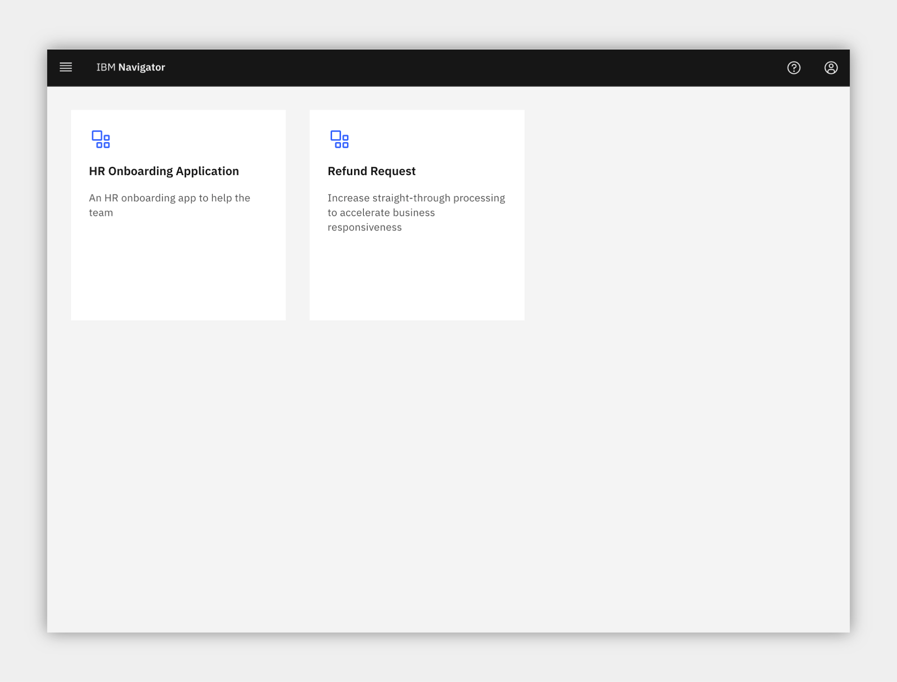
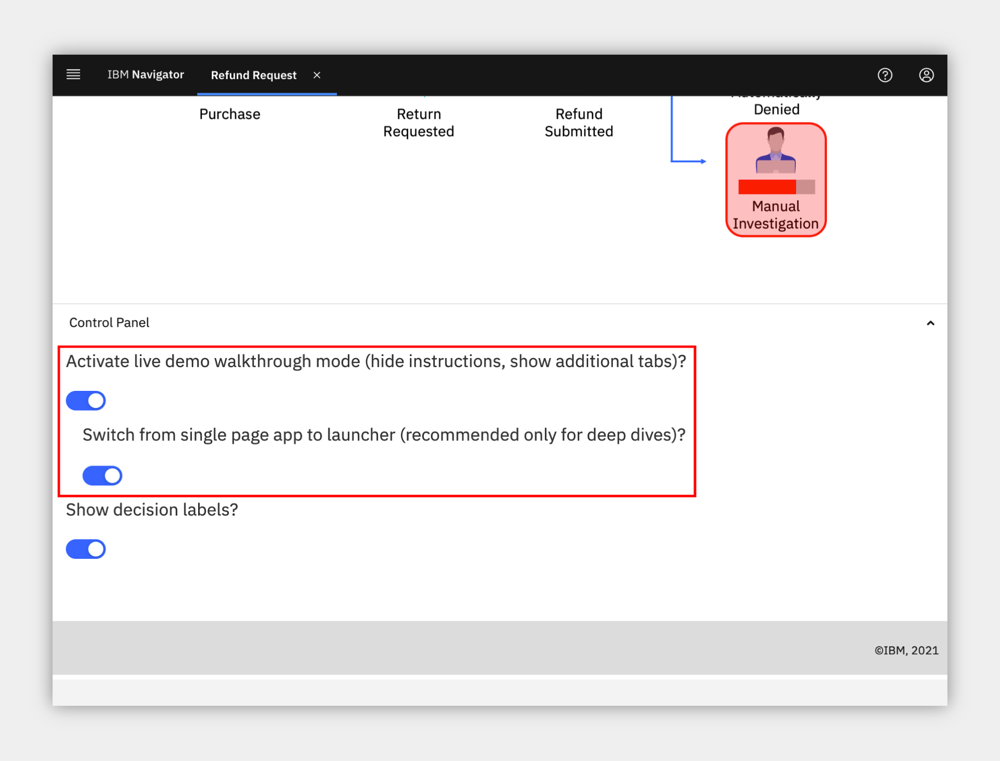
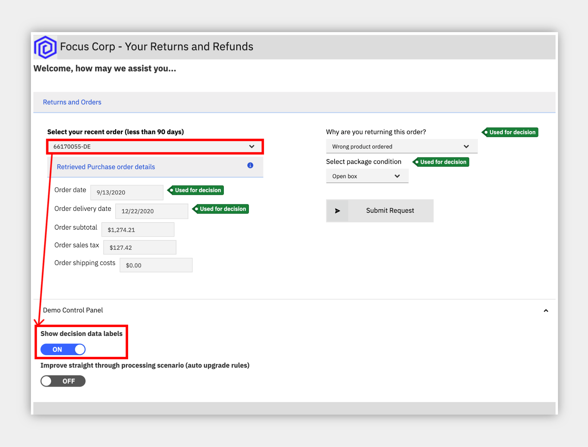
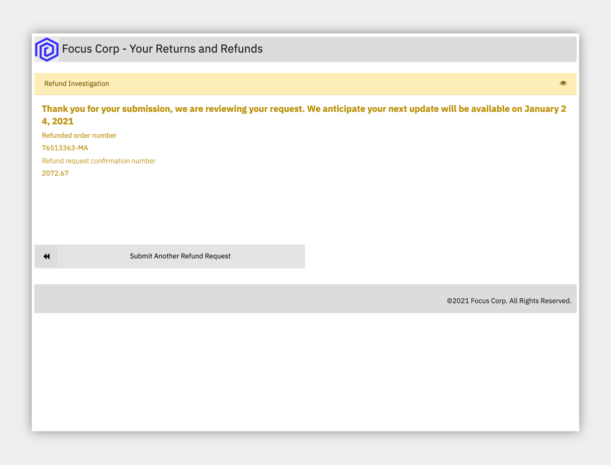
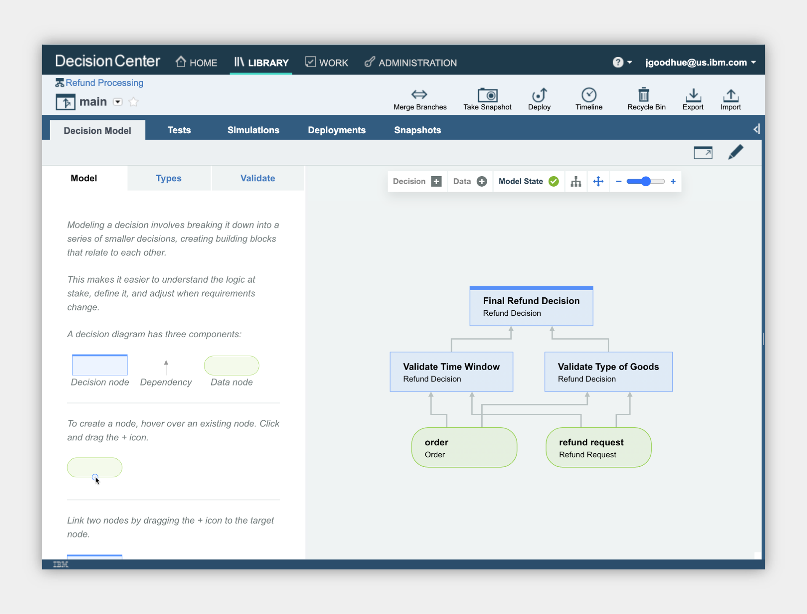
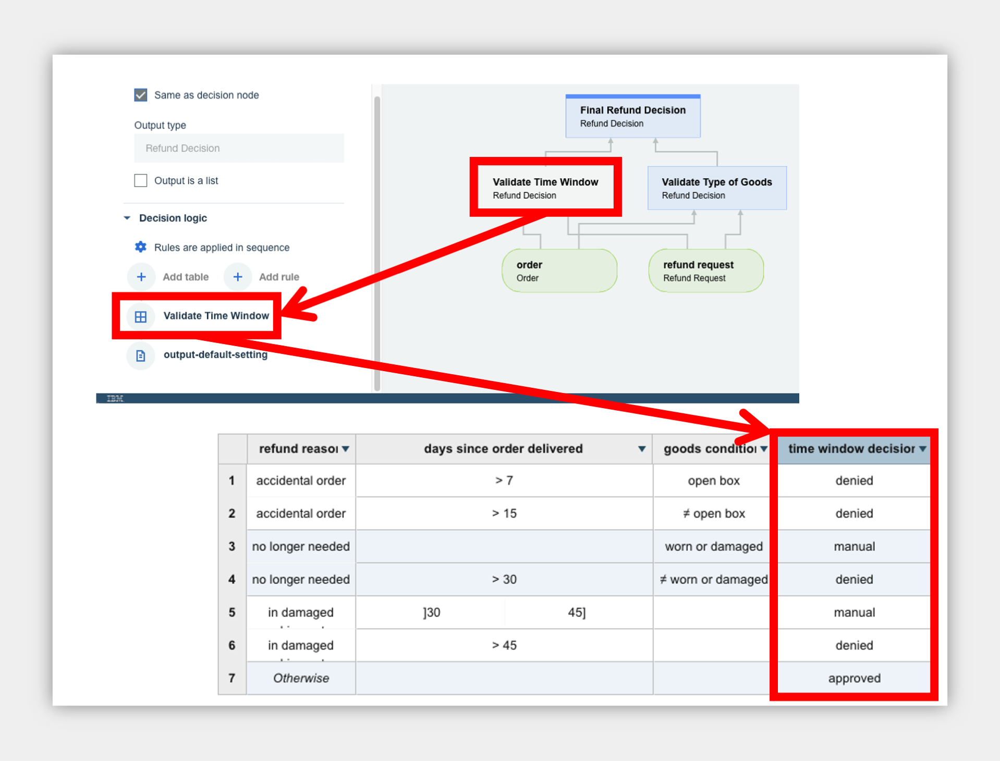
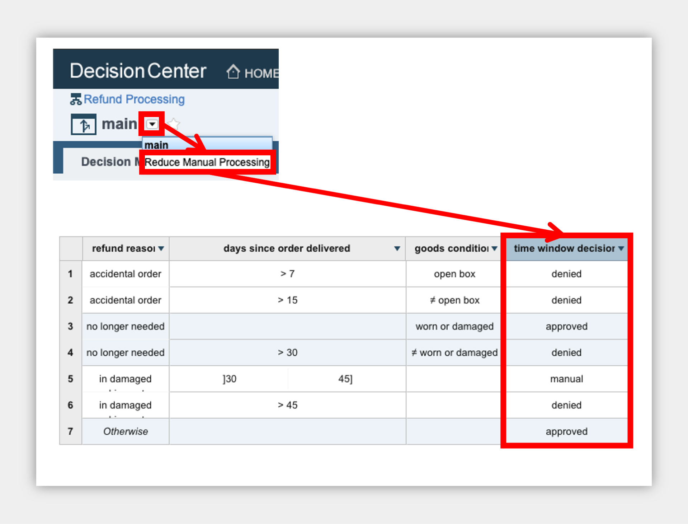
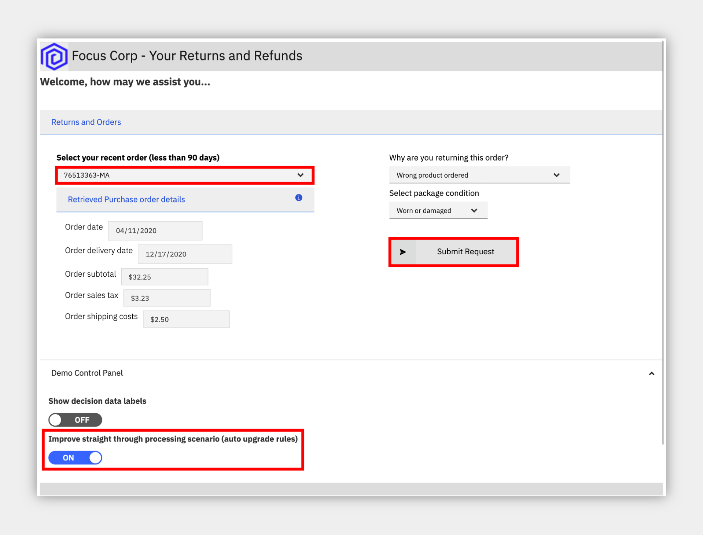
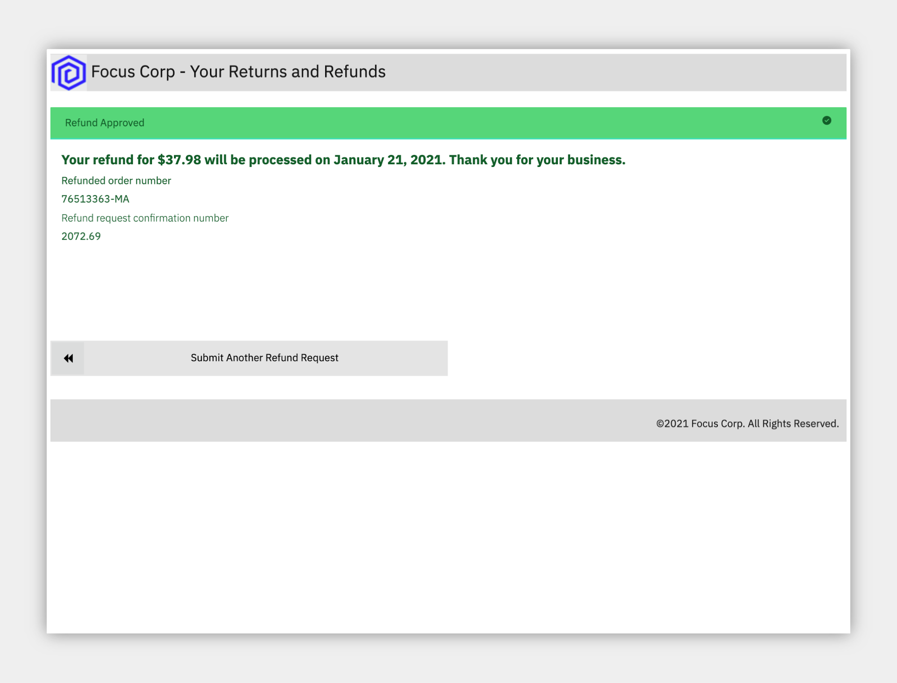
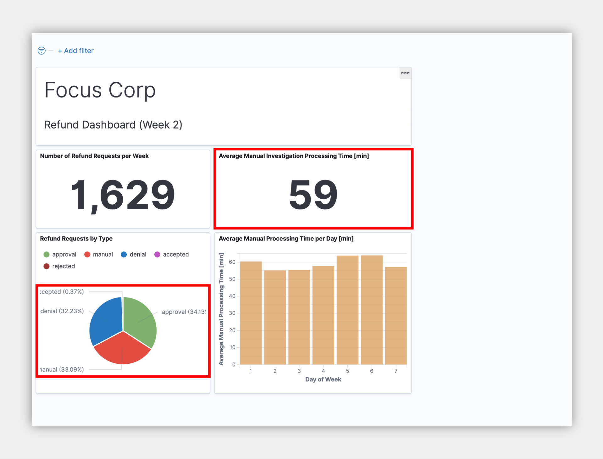

### an IBM Cloud Pak for Business Automation entry point

<AnchorLinks>
  <AnchorLink>Introduction</AnchorLink>
  <AnchorLink>Getting Started Lab</AnchorLink>
  <AnchorLink>Full Demo Narration</AnchorLink>
</AnchorLinks>

***

# Introduction

**Use Case Overview:** Imagine that a customer purchases your product, but is unfortunately unsatisfied and requests a refund. Today, your refund process has several manual steps. Managing high volumes of refunds that require manual investigation leads to slow average completion times, inconsistent status updates to customers, and higher costs for any errors made.
This use case demonstrates the use of automation in the form of straight-through-processing to save time, money, and customer frustration.

**Choose an option:**

  * **Cloud Pak for Business Automation as a Service demo environment (likely an IBMer):** your environment is predeployed, continue to the [Getting Started Lab](#getting-started-lab) section below.
  * **Install Yourself:** To deploy Refund Request on your own environment, and technical architecture information, see the <a href="https://github.com/ibm-cloud-architecture/dba-refund-request.git" target="_blank">dba-refund-request</a> git repository which includes the required deployment artifacts.

 

***

# Getting Started Lab

## Are you ready to see straight through processing in action?

 

1 - Scenario Introduction - Refund Request

<Row>
<Column colLg={5} colMd={5}>

**Demo Video**

<ArticleCard
    color="dark"
    title="Demo Video - Refund Request Automation"
    subTitle="In this demo, you will learn how to handle spikes in demand with straight-through processing through business automation"
    href="https://ibm.biz/cp4ba-refund-request-video"
    actionIcon="arrowRight"
    color="dark"
    >

</ArticleCard>
</Column>
<Column colLg={7} colMd={7}>

**Demo Outline**

[Full Demo Narration](#full-demo-narration)

1.	Use Case Overview
1.	Focus Corp Demo Dashboard review
1.	Customer persona
    1. Submit approved return
    1. Turn on decision labels
    1. Submit denied return
    1. Submit manual return
1.	Operations Specialist persona
    1. Week 1 dashboard
1.	Rule Manager persona
    1. Decision model review
    1. Review time window table, type of goods table, and one final text rule
    1. Switch to the Reduce Manual Processing branch
    1. Review type of goods table, compare
1.	Customer persona
    1. Turn on decision labels and auto update rules
    1. Submit manual return
1.	Operations Specialist persona
    1. Week 2 dashboard
1.	Use case review and value of straight-through processing

 

</Column>
</Row>
<Row>
<Column colLg={4} colMd={4}>

**Discovery Map**

 

</Column>
<Column colLg={7} colMd={7}>

**Process Diagram**

 

</Column>
</Row>

[Go to top](#lab-section-1) | [Go to Getting Started Lab](#getting-started-lab)

 

2 - Login and Setup Your Environment

 

Option 2A - Are you using a Cloud Pak for Business Automation as a Service demo environment (likely an IBMer)?

 

1. Standard Users, once your account administrator completes the below setup and provides you access, please continue.
1. Administrator Users, expand the following section to access additional steps to setup access for yourself and others in your environment:

 

Additional Cloud Administrator Setup

 

1. Login to your Cloud Pak for Business Automation as a Service demo environment <a href="http://automationcloud.ibm.com" target="_blank">here</a> to access your portal.
1. Open the menu in the upper left.
1. Under **Administer subscriptions**, click **Access management**.
1. Locate or search for your user and ensure all environments (Development and so on) are activated.
1. Click the pencil icon on the right side of your user row and ensure the appropriate roles are selected (below is an example set of roles).
1. Repeat this process for all users that need access using the below for reference.

 

<Row>
<Column colLg={4} colMd={4}>

**All User Access Roles**

 

</Column>
<Column colLg={4} colMd={4}>

**All Administrator Roles**

 

</Column>
</Row>

 

> Standard Users, continue here...

3. Login to your Cloud Pak for Business Automation as a Service demo environment <a href="http://automationcloud.ibm.com" target="_blank">here</a> to access your portal.
4. Open the menu in the upper left
5. Select **Production** and then **Run**

 

 

 

6. Click the **Business Automation Apps** tile to launch the Business Automation Navigator desktop
7. Wait for the desktop to load in a new browser window/tab (it can take some time)
8. Start by reviewing the available demos, they all represent a business automation use case so you can easily get started.
 

 

 

9. When ready, click the **Refund Request** tile to launch the use case.
10. You have two options to navigate the Refund Request use case:
    1. **Step by step**: the default interface will provide you step by step guidance with instructions, step completion check boxes, and a summary of what you learned in each step.  If you choose this option, _please **STOP** reading here and continue in the application_.
    1. **Deep dive**: If you are an experienced user, you may prefer to explore using the launchpad.  To activate it, scroll to the bottom of the app and locate the Control Panel section, expand it and select the first switch followed by the new second switch that appears.

     

    > Note: The below image is for deep dive users only

     

     

     
11. If you chose the **Deep dive** option, continue to use the below documentation and explore.

 

Option 2B - Are You Using Your Own Environment (not a demo environment)?

 

1. Standard Users, once your account administrator completes the below setup and provides you access, please continue.
1. Administrator Users, expand the following section to access additional information to setup access for yourself and others in your environment:

 

Additional Administrator Setup For Your Own Environment

 

See the <a href="https://github.com/ibm-cloud-architecture/dba-refund-request.git" target="_blank">dba-refund-request</a> git repository to deploy on your own platform.

 

> Standard Users, continue here...

1. Ask your administrator for the URL to the desktop in Business Automation Navigator and your login credentials
1. Wait for the desktop to load in a new browser window/tab (it can take some time) and log in

 

1. Start by reviewing the available demos, they all represent a business automation use case so you can easily get started.
1. When ready, click the **Refund Request** tile to launch the use case

> Please continue to the next section...

 

[Go to top](#lab-section-2) | [Go to Getting Started Lab](#getting-started-lab)

 

3 - Submit some refunds

#### Be your customer!

 

You are now a customer that just purchased a product, but unfortunately you are unsatisfied and request a refund.  What do you experience?
As a customer, you want quick answers to your refund requests, especially when there are no special circumstances that should cause a delay.  Straight through processing would be ideal for you.

> Note: you should only continue with these steps if you choose the **Deep dive** option listed above in section 2!

1. Check the tabs to learn more about the demo
    1. **Storyboard Outline**
    1. **Demo Discovery Map**
    1. **Demo Diagram**

 

1. Navigate to the **Launch the Demo** tab and then click on the picture of the **Customer**

 

1. Use the drop down to select the order ending in **AP**.

> NOTE: there are three orders setup to provide the following results
> * AP = approved
> * DE = denied
> * MA = manually investigated

 

 

1. Click **Submit** to see the results
1. Choose to submit another refund request
1. Select the order ending in **DE**
1. At the bottom, expand the **Demo Control Panel**
1. Turn on the decision labels to see which data is used to make the decision
1. Submit the refund if desired

 

1. Submit another refund request
1. Select the order ending in **MA**
1. Submit the refund and see that a manual investigation is required

 

 

[Go to top](#lab-section-3) | [Go to Getting Started Lab](#getting-started-lab)

 

4 - (Optional) Complete the investigation task

 
You are now a Focus Corp employee, first an Refund Investigator and later an Operations Specialist and Rule Manager.

 
 

Refund Invesigators are busy people as they not only process refunds that cannot be automatically approved or denied, but they also look into trends and perform data analysis across the Focus Corp organization.  When they need to take time out from their high priority work to perform a refund request, they are not too happy.  Luckily, Cloud Pak for Business Automation provides them all the information they need in one place and streamlines the investigation process.

 

 

 

1. Click **Return to launchpad**
2. Click the picture of the **Refund Investigator**
3. Choose your preferred interface, if prompted
4. Review the list of tasks and click on the most recent Investigation task to claim and complete it

> Note the data is passed from the application to the process which then retrieved additional information and routed the work to the appropriate Refund Investigator

6. Complete the task by approving or denying the refund

 

[Go to top](#lab-section-4) | [Go to Getting Started Lab](#getting-started-lab)

 

5 - Review the Operations Dashboard

 
You are now a different Focus Corp employee, an Operations Specialist.  How can you help to improve straight through processing?
 
Operations Specialists are able to easily monitor business automation performance and identify problems before they become large.

 

 

1. Navigate back to the Refund Request application browser window/tab
2. Click the picture of the **Operations Specialist**
3. Click to open the **Refund Request (RR) - Week 1** dashboard
4. Review the week 1 dashboard metrics and note the following:
    1. A large number of manual requests in the pie chart
    1. The high time for average manual investigation processing (~120 minutes)

 

 

 

[Go to top](#lab-section-5) | [Go to Getting Started Lab](#getting-started-lab)

 

6 - Improve the business rules

 

Now, take on the role of a Focus Corp Rule Manager who can adjust rules, validate and simulate the decision service and deploy quickly and easily.

 

1. Navigate back to the Refund Request application browser window/tab
2. Click the picture of the **Rule Manager**
3. Click **Refund Processing** followed by **main** to open the decision model
4. Review the decision model, green ovals are input data and blue boxes are decisions, each with their own business logic leading to the **Final Refund Decision**

 

 

 

5. Click the blue **Validate Time Window** decision node
6. On the left pane, scroll to the bottom and click to open the **Validate Time Window** logic
7. Review the decision table and note multiple rows that lead to manual review.

 

 

> The Rule Manager already created a new branch to try some rule adjustments.

8. At the upper left, click the down arrow next to **main** and select **Reduce Manual Processing**
9. Open the same **Validate Time Window** decision node and table
10. Review the decision table and note there are less manual review rows.

> NOTE: In the full lifecycle, a Rule Manager runs test suites and simulations before deploying the rules.  If you wish and feel comfortable, you can explore this on your own.

 

 

[Go to top](#lab-section-6) | [Go to Getting Started Lab](#getting-started-lab)

 

7 - Test the new business rules

 

1. Close the rules browser window/tab
2. Click the picture of the **Customer**
3. Scroll to the bottom and expand the **Demo Control Panel**
4. Turn on the improved straight through processing scenario
5. Select the recent order ending with **MA** and submit

 

## The "MA" order was previously categorized as a manually processed refund request, now it is APPROVED!

 

 

 

 

[Go to top](#lab-section-7) | [Go to Getting Started Lab](#getting-started-lab)

 

8 - Review the updated Operations Dashboard

 

1. Click **Return to launchpad**
2. Click the picture of the **Operations Specialist**
3. Click to open the **Refund Request (RR) - Week 2** dashboard
4. Review the dashboard metrics and note the following
    1. a smaller number of manual requests in the pie chart
    1. a lower time for average manual investigation processing (~60 minutes)

 

## The improved straight through processing is working!

 

[Go to top](#lab-section-8) | [Go to Getting Started Lab](#getting-started-lab)

 

9 - Summary

 

With combined workflow and decision automation, both capabilities within IBM Cloud Pak for Business Automation, and updated business rules, we reduce the manual processing queues significantly.

 

Increased straight through processing results in lower average completion time, lower costs, and more consistent communication with the customer throughout the process.  Now our processes can truly increase customer satisfaction.

 

[Go to top](#lab-section-9) | [Go to Getting Started Lab](#getting-started-lab)

***

 
 

# Full Demo Narration

#### Focus Corp Demos Dashboard

Reviewing the Focus Corp Demos Dashboard we see a text summary describing the demo, a discovery map diagram and a flow diagram for our reference.  OK, let's launch the demo...

#### Customer refund requests

We start by becoming the customer.  From the Focus Corp Your Returns and Refunds portal, we select one of our recent orders and submit a return.  The result is approved with an expected date to receive funds.

We select and submit another order for refund but before we submit, let's take a peak behind the form at some of the business rules.  A few of the fields are used by a set of business rules to make the refund decision and we see those here.  This refund request results in a denial but it is still straight through processing without any manual work.

Upon selecting a final, third order, the rules this time are not certain and send the refund request off to a human queue for manual investigation.  This bottom investigation branch of the straight through process can utilize significant resources.

#### Operations week 1

A few manual refunds are not a problem for the team, but too many will cause delays and our customer satisfaction will go down.  The Operations Specialist reviews the Refund Dashboard, powered by Business Automation Insights and see not only the percentage of manually processed requests is high at more than 67% but the average manual investigation time across all requests is more than 2 hours.  They pass their findings to the Rule Manager to take action.

#### Rules manager

As a rules manager, we have access to the decision model behind our refund process. The data is passed from the process system to the rules in the form of an order and refund request.  This moves through various decision tables including a time window validation that deals with the return reason, the days since delivery and the condition of the goods.  In combination, these lead to various processing decisions and we see a few that result in manual processing listed.  Another decision table deals with the type of goods and may also result in some manual processing.  Finally, this is then combined with a simple text rule to make the final decision.

The rules manager drafted up a new branch of the decision model with some updates, let's take a look.  To reduce manual processing, the rules manager adjusted the tables to remove some of the manual processing decisions.  Comparing the two versions shows that row 3 column 3 moved from manual to denied, for example.  Other rows were removed which results in an default approved decision.  We could also test and simulate the rule changes and compare historical results but we won't cover that here in this demo.

#### Customer manual to approved

After the Rules Manager deploys the new rules, let go back to being a customer and try them out.  Submitting the same order as before which resulted in a manual result now is approved!

#### Operations week 2

After these new rules are in place for a week, the Operations Specialist sees some solid improvement with a reduction in half for manual requests and also lower manual processing time average from above 120, down to only 60 mins.

#### Use Case Summary

With combined workflow and decision automation, both capabilities within IBM Cloud Pak for Automation, and updated business rules, we reduce the manual processing queues significantly

Increased straight through processing results in lower average completion time, lower costs, and more consistent communication with the customer throughout the process.  Now our processors can truly increase customer satisfaction.

 

[Go to top](#full-demo-narration) | [Go to Getting Started Lab](#getting-started-lab) | [Go to Introduction](#introduction)
