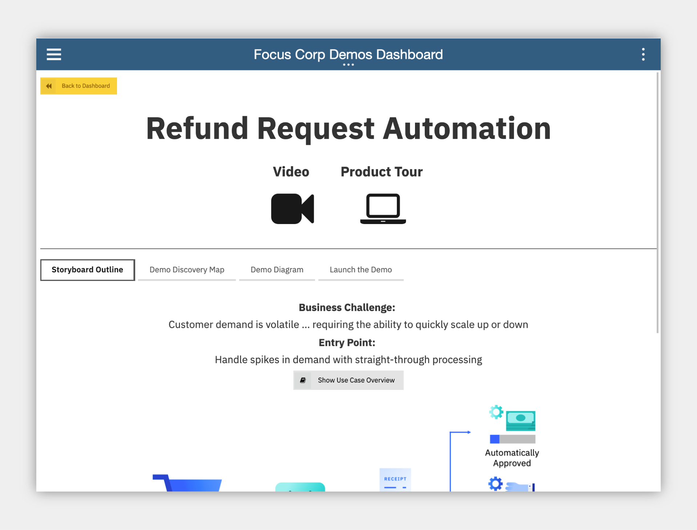
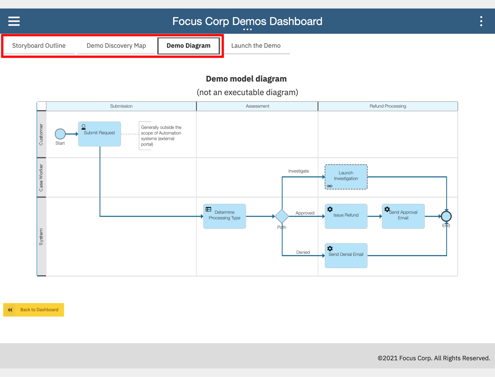
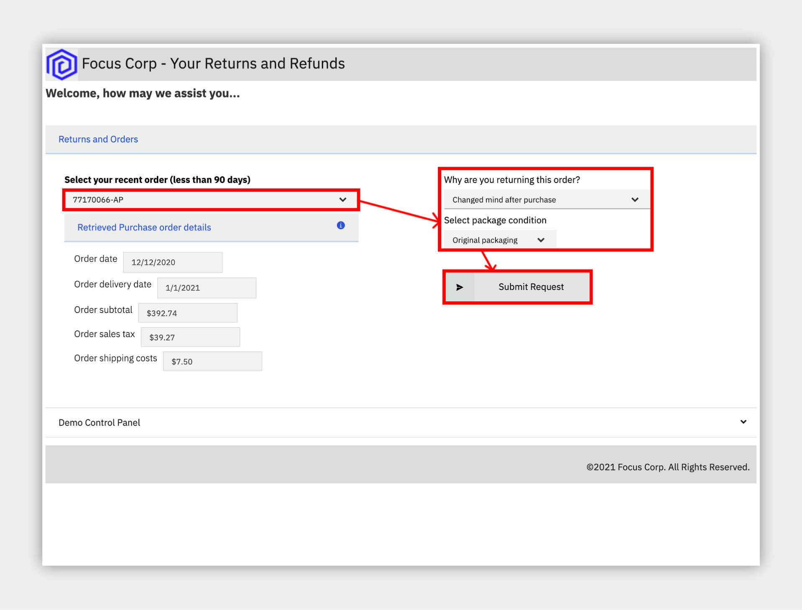
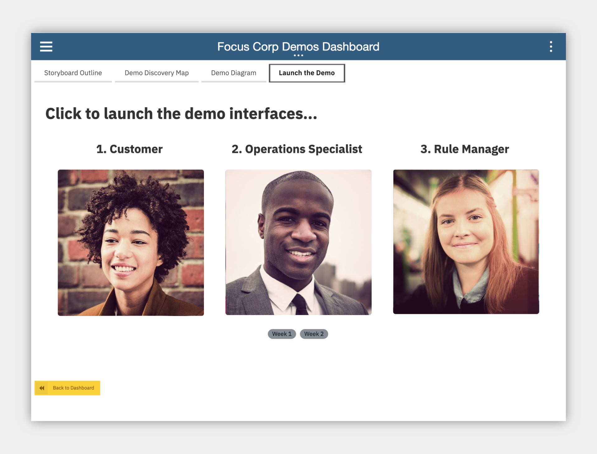
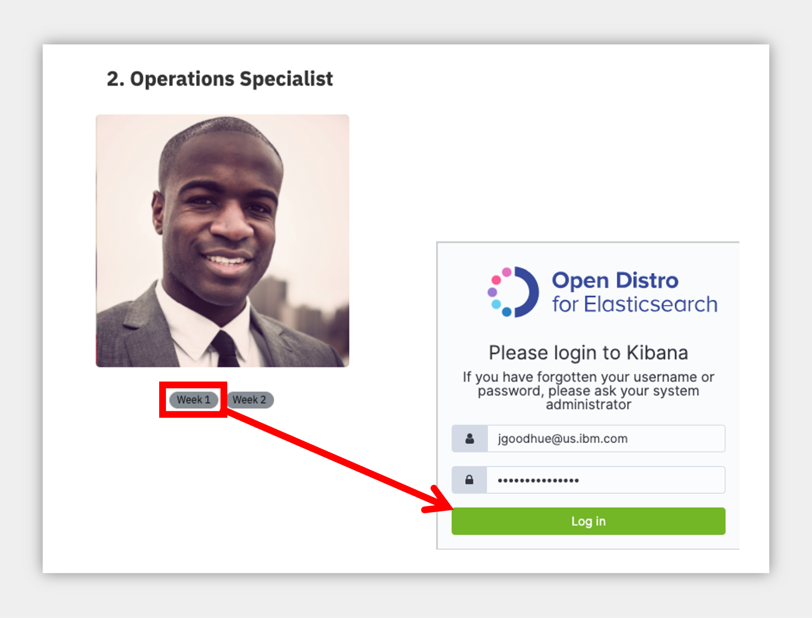
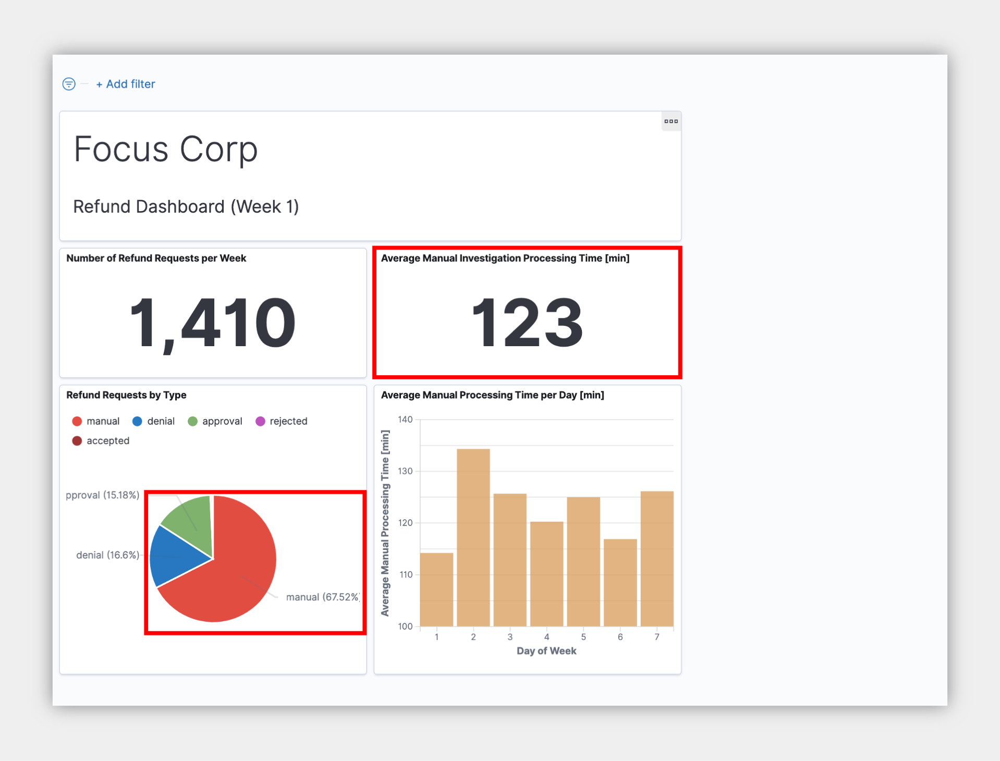

<InlineNotification kind="warning">
<strong>Updated 2021-02-07</strong> - Work in progress
</InlineNotification>

# Refund Request Automation

**an IBM Cloud Pak for Business Automation entry point**

<AnchorLinks>
  <AnchorLink>Scenario Overview</AnchorLink>
  <AnchorLink>Preparation and Deployment</AnchorLink>
  <AnchorLink>Use Case Guided Tour</AnchorLink>
</AnchorLinks>

## Scenario Overview

Imagine that a customer purchases your product, but is unfortunately unsatisfied and requests a refund. Today, your refund process has several manual steps. Managing high volumes of refunds that require manual investigation leads to slow average completion times, inconsistent status updates to customers, and higher costs for any errors made. Although you have guidelines that determine when a refund is approved or denied, there are still inconsistencies in the decision-making. This use case demonstrates the use of automation in the form of straight-through-processing to save time, money, and customer frustration.

## Preparation and Deployment

The [dba-refund-request](https://github.com/ibm-cloud-architecture/dba-refund-request.git) git repository includes the artifacts needed for this lab.

### Environment

We assume the following products are installed, up and running:

- IBM Cloud Pak® for Automation version 20.0.2
    - Business Automation Workflow (BAW) on VMs
    - Operational Decision Manager (ODM) on OpenShift
    - Business Automation Insights (BAI) on OpenShift (Optional, can be run without)

### Deploy the artifacts

1. Determine your credentials
    1. For BAW, use your own credentials to login to Workflow Center and Process Portal
    1. For ODM, create a service credential/account or use your own basic auth credentials to login to Rule Execution Server console
    1. For BAI, set your password as required by your platform and login to Kibana
1. Deploy ODM artifacts
    1. Login to Decision Center Business console
    1. On Library, click the import icon
    1. Import `Refund Processing [main].zip`
    1. Open the main branch, click Deployments and deploy to your Rule Execution Server (adjust the server within the deployment configuration as required)
    1. Return to the branch list and click the plus sign to create a new branch based on main named Reduce Manual Processing
    1. Import `Refund Processing [Reduce Manual Processing].zip` to the new branch and choose to replace the existing elements
    1. Deploy the new branch as a second version
1. (Optional) Deploy BAI artifacts
    1. Login to Kibana
    1. Management -> Saved Objects -> Import -> `RefundRequest YYYY.MM.DD_XX.json`
1. Deploy BAW artifacts
    1. Login to Workflow Center and navigate to Process Apps
    1. Import `Refund_Request - YYYY.MM.DD_XX.twx`
    1. Open the Refund Request process app and navigate to Process App Settings -> Servers
    1. Edit the settings for hostname, port, authentication and so forth for your ODM server
    1. (Optional) Open the BAI Generators team and add an appropriate user to the team
    1. Go back to Workflow Center and create a new snapshot of the process application
    1. Install the new snapshot to your Workflow Server unless you wish to run directly on Workflow Center's playback server (to support the optional BAI events, make sure the BAW server running the process app has BAI emitters enabled)
1. (Optional) Setup BAI data
    1. Login to Process Portal with the user specified in the above BAI Generators team
    1. Under Launch, click Generate Week 1 BAI Data RR and wait for the spinner to complete in about 20 seconds
    1. Do the same for Generate Week 2 BAI Data RR
    1. Login to Kibana
    1. Management -> Index Patterns -> process-sum* -> refresh icon
    1. To improve the dashboard, edit the` `data.TG.pTime.integer` field and set the Format to `Number` and the Numeral.js format pattern to `0,0` and save
    1. Open the Dashboard -> Refund Request (RR) - Week 1 and Week 2 and check that data is displayed.  If it is not, check your emitters are sending data and connected to the BAW server where the Process App is deployed.

***

**Business Challenge:** Customer demand is volatile ... requiring the ability to quickly scale up or down
As the Focus Corp Demo Dashboard is currently embedded within the process app and deployed to the Process Portal, it is recommended that you make this your default dashboard.

**Entry Point:** Handle spikes in demand with straight-through processing

**Use Case Overview:** Imagine that a customer purchases your product, but is unfortunately unsatisfied and requests a refund. Today, your refund process has several manual steps. Managing high volumes of refunds that require manual investigation leads to slow average completion times, inconsistent status updates to customers, and higher costs for any errors made.
This use case demonstrates the use of automation in the form of straight-through-processing to save time, money, and customer frustration.

**Choose an option:**

  * **Digital Business Automation on Cloud trial:** your environment is predeployed, continue to the [Guided Tour](#use-case-guided-tour) section below.
  * **Install Yourself:** To deploy Refund Request on your own environment, and technical architecture information, see the <a href="https://github.com/ibm-cloud-architecture/dba-refund-request.git" target="_blank">dba-refund-request</a> git repository which includes the required deployment artifacts.

 

***

# Use Case Guided Tour

## Are you ready to see straight through processing in action?

1 - Scenario Introduction - Refund Request

<Row>
<Column colLg={5} colMd={5}>

**Demo Video**

<ArticleCard
    color="dark"
    title="Demo Video - Refund Request Automation"
    subTitle="In this demo, you will learn how to handle spikes in demand with straight-through processing through business automation"
    href="https://www.youtube.com/watch?v=u5Pw-uL5STA&"
    actionIcon="arrowRight"
    color="dark"
    >

</ArticleCard>
</Column>
<Column colLg={7} colMd={7}>

**Demo Outline**

[Full Demo Narration](#full-demo-narration)

1.	Use Case Overview
1.	Focus Corp Demo Dashboard review
1.	Customer persona
    1. Submit approved return
    1. Turn on decision labels
    1. Submit denied return
    1. Submit manual return
1.	Operations Specialist persona
    1. Week 1 dashboard
1.	Rule Manager persona
    1. Decision model review
    1. Review time window table, type of goods table, and one final text rule
    1. Switch to the Reduce Manual Processing branch
    1. Review type of goods table, compare
1.	Customer persona
    1. Turn on decision labels and auto update rules
    1. Submit manual return
1.	Operations Specialist persona
    1. Week 2 dashboard
1.	Use case review and value of straight-through processing

 

</Column>
</Row>
<Row>
<Column colLg={4} colMd={4}>

**Discovery Map**

 

</Column>
<Column colLg={6} colMd={6}>

**Process Diagram**

 

</Column>
</Row>

[Go to top](#refund-request-automation) | [Go to Guided Tour](#use-case-guided-tour)

2 - Login to Your Digital Business Automation on Cloud Trial

Login to your Digital Business Automation on Cloud trial <a href="http://automationcloud.ibm.com" target="_blank">here</a> to access your portal.
 
Don't have a trial yet? <a href="https://www.ibm.com/account/reg/us-en/signup?formid=urx-45706" target="_blank">Sign up</a> to get started or see the <a href="https://github.com/ibm-cloud-architecture/dba-refund-request.git" target="_blank">dba-refund-request</a> git repository to deploy on your own platform.

 

[Go to top](#refund-request-automation) | [Go to Guided Tour](#use-case-guided-tour)

3 - Setup Your Trial SaaS Environment

 

First time in your trial environment?  Here are some recommended setup steps to get the best experience!

### IMPORTANT - Assign Your Roles

 

You will need to make sure you have the correct roles to use the environment.

1. Open the menu in the upper left.
1. Under **Administer subscriptions**, click **Access management**.
1. Locate or search for your user and ensure all environments (Development and so on) are activated.
1. Click the pencil icon on the right side of your user row and ensure at least the required roles are selected.
1. Optionally add all adinistrator roles as appropriate.

 

<Row>
<Column colLg={4} colMd={4}>

**Required Roles**

 

</Column>
<Column colLg={4} colMd={4}>

**All Administrator Roles**

 

</Column>
</Row>

### Setup Decision Center Business Console Servers

You may need to setup new servers in the Decision Center Administation console to deploy and execute decisions.

1. (step to be documented...)

### Setup your Process Portal

It is recommended to make the Focus Corp Demo Dashboard your default dashboard.

1. Log in to your **Process Portal** environment.
1. Under Dashboards click **Show more...** and click the icon next to **Focus Corp Demo Dashboard** and click the star icon.
1. Drag the right-side handle of that dashboard row to the top so this will load when you start Process Portal.

### Personalize your Process Portal

* Click the **Edit Profile** link in the upper left
* Add a picture
* Set notification settings as desired

 

[Go to top](#refund-request-automation) | [Go to Guided Tour](#use-case-guided-tour)

4 - Open the Focus Corp Demo Dashboard

1. Open the menu in the upper left
2. Select **Production** and then **Run**
3. Click the **Process Portal** tile
4. Wait for the portal to load in a new browser window/tab

 

5. On the left menu, under the **Dashboards**, click **Show more/less…**
6. Click **Focus Corp Demos Dashboard**
7. Wait for the dashboard to load on the right

 

Start by reviewing the available demos, they all represent an entry point to business automation so you can easily get started.
 

 

 

When ready, click the green **Refund Request** button to launch the demo.

 

[Go to top](#refund-request-automation) | [Go to Guided Tour](#use-case-guided-tour)

5 - Submit some refunds

#### Be your customer!

 
You are now a customer that just purchased a product, but unfortunately you are unsatisfied and request a refund.  What do you experience?
As a customer, you want quick answers to your refund requests, especially when there are no special circumstances that should cause a delay.  Straight through processing would be ideal for you.

 

 

1. Check the tabs to learn more about the demo
    1. **Storyboard Outline**
    1. **Demo Discovery Map**
    1. **Demo Diagram**

 

2. Navigate to the **Launch the Demo** tab and then click on the picture of the **Customer**

 

3. Use the drop down to select the order ending in **AP**.

> NOTE: there are three orders setup to provide the following results
> * AP = approved
> * DE = denied
> * MA = manually investigated

 

 

4. Complete the drop-downs on the right with any values
5. Click **Submit** to see the results
6. Choose to submit another refund request
7. Select the order ending in **DE**
8. At the bottom, expand the **Demo Control Panel**
9. Turn on the decision labels to see which data is used to make the decision
10. Submit the refund if desired

 

11. Submit another refund request
12. Select the order ending in **MA** and complete the drop downs
13. Submit the refund and see that a manual investigation is required

 

 

[Go to top](#refund-request-automation) | [Go to Guided Tour](#use-case-guided-tour)

6 - Review the Operations Dashboard

 
You are now a Focus Corp employee, first an Operations Specialist and later a Rule Manager.  How can you help to improve straight through processing?
 
Operations Specialists are able to easily monitor process performance and identify problems before they become large.  Rule Managers can adjust rules, validate and simulate the decision service and deploy quickly and easily.

 

 

1. Navigate back to the Focus Corp Demos Dashboard browser window/tab
2. Click on **Week 1** under the picture of the **Operations Specialist**
3. Login to the **Insights Dashboard**

> NOTE: If this is your FIRST TIME, your password may not work; go back to the SaaS portal, mouse over your name in the upper right and click Set Password.  Once complete, come back and login to the Open Distro for Elasticsearch / Kibana.

 

 

4. Review the Week 1 dashboard metrics and note the following:
    1. A large number of manual requests in the pie chart
    1. The high time for average manual investigation processing (~120 minutes)

 

 

 

[Go to top](#refund-request-automation) | [Go to Guided Tour](#use-case-guided-tour)

7 - Improve the business rules

 

1. Navigate back to the Focus Corp Demos Dashboard browser window/tab
2. Click the picture of the **Rule Manager**
3. Click **Refund Processing** followed by **main** to open the decision model
4. Review the decision model, green ovals are input data and blue boxes are decisions, each with their own business logic leading to the **Final Refund Decision**

 

 

 

5. Click the blue **Validate Time Window** decision node
6. On the left pane, scroll to the bottom and click to open the **Validate Time Window** logic
7. Review the decision table and note multiple rows that lead to manual review.

 

 

 

The Rule Manager created a new branch to try out some rule adjustments.

 

8. At the upper left, click the down arrow next to main and select **Reduce Manual Processing**
9. Open the same **Validate Time Window** decision node and table
10. Review the decision table and note there are less manual review rows.

> NOTE: In the full lifecycle, a Rule Manager runs test suites and simulations before deploying the rules, which is already completed.

 

 

[Go to top](#refund-request-automation) | [Go to Guided Tour](#use-case-guided-tour)

8 - Improve straight through processing

 

1. Close the rules browser window/tab
2. Click the picture of the **Customer**
3. Expand the **Demo Control Panel**
4. Turn on the improved straight through processing scenario
5. Select the recent order ending with **MA**, fill in the drop downs and submit

 

## The "MA" order was previously categorized as a manually processed refund request, now it is APPROVED!

 

 

 

6. Navigate back to the Focus Corp Demos Dashboard browser window/tab
7. Under the picture of the **Operations Specialist**, click **Week 2**
8. Review the dashboard metrics and note the following
    1. a smaller number of manual requests in the pie chart
    1. a lower time for the average manual i

 

## The improved straight through processing is working!

 

[Go to top](#refund-request-automation) | [Go to Guided Tour](#use-case-guided-tour)

9 - Summary

 

With combined workflow and decision automation, both capabilities within IBM Cloud Pak for Automation, and updated business rules, we reduce the manual processing queues significantly

 

Increased straight through processing results in lower average completion time, lower costs, and more consistent communication with the customer throughout the process.  Now our processors can truly increase customer satisfaction.

 

[Go to top](#refund-request-automation) | [Go to Guided Tour](#use-case-guided-tour)

***

 
 

# Full Demo Narration

#### Focus Corp Demos Dashboard

Reviewing the Focus Corp Demos Dashboard we see a text summary describing the demo, a discovery map diagram and a flow diagram for our reference.  OK, let's launch the demo...
=======
    * Submit approved return
    * Turn on decision labels
    * Submit denied return
    * Submit manual return
1.	Operations Specialist persona
    * Week 1 dashboard
1.	Rule Manager persona
    * Decision model review
    * Review time window table, type of goods table, and one final text rule
    * Switch to the Reduce Manual Processing branch
    * Review type of goods table, compare
1.	Customer persona
    * Turn on decision labels and auto update rules
    * Submit manual return
1.	Operations Specialist persona
    * Week 2 dashboard
1.	Use case review and value of straight-through processing

### Demo Narration and Flow

#### Corp Demos Dashboard

Reviewing the `Focus Corp Demos Dashboard` we see a text summary describing the demo, a discovery map diagram and a flow diagram for our reference.  OK, let's launch the demo...

#### Customer refund requests

We start by becoming the customer.  From the Focus Corp Your Returns and Refunds portal, we select one of our recent orders and submit a return.  The result is approved with an expected date to receive funds.

We select and submit another order for refund but before we submit, let's take a peak behind the form at some of the business rules.  A few of the fields are used by a set of business rules to make the refund decision and we see those here.  This refund request results in a denial but it is still straight through processing without any manual work.

Upon selecting a final, third order, the rules this time are not certain and send the refund request off to a human queue for manual investigation.  This bottom investigation branch of the straight through process can utilize significant resources.

#### Operations week 1

A few manual refunds are not a problem for the team, but too many will cause delays and our customer satisfaction will go down.  The Operations Specialist reviews the Refund Dashboard, powered by Business Automation Insights and see not only the percentage of manually processed requests is high at more than 67% but the average manual investigation time across all requests is more than 2 hours.  They pass their findings to the Rule Manager to take action.

#### Rules manager

As a rules manager, we have access to the decision model behind our refund process. The data is passed from the process system to the rules in the form of an order and refund request.  This moves through various decision tables including a time window validation that deals with the return reason, the days since delivery and the condition of the goods.  In combination, these lead to various processing decisions and we see a few that result in manual processing listed.  Another decision table deals with the type of goods and may also result in some manual processing.  Finally, this is then combined with a simple text rule to make the final decision.

The rules manager drafted up a new branch of the decision model with some updates, let's take a look.  To reduce manual processing, the rules manager adjusted the tables to remove some of the manual processing decisions.  Comparing the two versions shows that row 3 column 3 moved from manual to denied, for example.  Other rows were removed which results in an default approved decision.  We could also test and simulate the rule changes and compare historical results but we won't cover that here in this demo.

#### Customer manual to approved

After the Rules Manager deploys the new rules, let go back to being a customer and try them out.  Submitting the same order as before which resulted in a manual result now is approved!

#### Operations week 2

After these new rules are in place for a week, the Operations Specialist sees some solid improvement with a reduction in half for manual requests and also lower manual processing time average from above 120, down to only 60 mins.

#### Use Case Summary

With combined workflow and decision automation, both capabilities within IBM Cloud Pak for Automation, and updated business rules, we reduce the manual processing queues significantly

Increased straight through processing results in lower average completion time, lower costs, and more consistent communication with the customer throughout the process.  Now our processors can truly increase customer satisfaction.

 

[Go to top](#refund-request-automation) | [Go to Guided Tour](#use-case-guided-tour)
