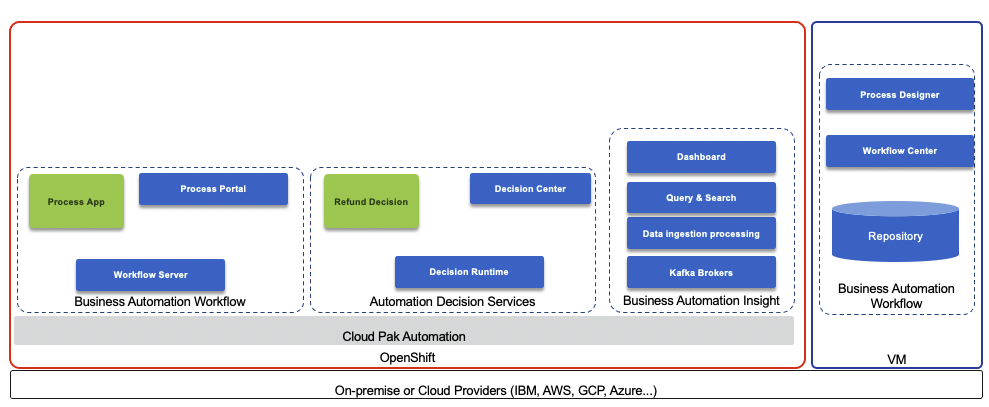

This scenario illustrates how to increase straight-through processing with process and decision automation to save time, money, and customer frustration. It uses the Business Automation Workflow, Automate Decision Service, Business Automation Insights

<InlineNotification kind="warning">
<strong>Updated 10/21/2020</strong> - Work in progress
</InlineNotification>

<AnchorLinks>
  <AnchorLink>Scenario overview</AnchorLink>
  <AnchorLink>Preparation</AnchorLink>
  <AnchorLink>Demo script</AnchorLink>
  <AnchorLink>Build it yourself lab</AnchorLink>
</AnchorLinks>

## Scenario overview

Imagine that a customer purchases your product, but is unfortunately unsatisfied and requests a refund. Today, your refund process has several manual steps. Managing high volumes of refunds that require manual investigation leads to slow average completion times, inconsistent status updates to customers, and higher costs for any errors made. Although you have guidelines that determine when a refund is approved or denied, there are still inconsistencies in the decision-making. This use case demonstrates the use of automation in the form of straight-through-processing to save time, money, and customer frustration.

The following diagram illustrates the products involved and the solution components:

 

## Preparation

The [dba-refund-request](https://github.com/ibm-cloud-architecture/dba-refund-request.git) git repository includes the decision services and workflow definitions needed for this lab.

For a light weight demonstration Business Automation Insight is not used. 

### Environment

We assume the following products are installed, up and running:

* Cloud Pak for Automation version 2020.3 on OpenShift
* Decision Services
* Process Center and Process Designer on VM

### Setup your Navigator and Process Portal

As the `Focus Corp Demo Dashboard` is in the Process Portal for now, it is recommended that you make this your default dashboard.

* Log in to the Process Portal environment you wish to use (Run, Development, etc.).
* Under Dashboards click Show more… and click the icon next to Focus Corp Demo Dashboard and click the star icon.
* Drag the right-side handle of that dashboard row to the top so this will load when you start Process Portal.

Why not personalize your Process Portal environment?  Click the Edit Profile link in the upper left and add a picture.

If you do need to use the Work list, it is recommended to create a saved search (maybe name it My Work) that filters to your demo’s tasks.

* Go to the default Work dashboard.
* Click the Saved Search editor icon in the upper right ().
* Click Add to create a criteria which can be a simple search or a filter by attribute such as process definition name.
* Make sure to Show Advanced Options when done, name your search and click Save so it will show on the left menu.
* You can also drag this to the top as you did for the Focus Corp Demo Dashboard so it will start automatically.

## Demo script

The following diagrams describe the use case.  They are not necessarily meant to represent an executable business process and are more a business model to describe the flow. 

*Caution should be used in presenting these to clients without appropriate contextof the difference between business modeling and process execution modeling.*


The [following video](https://www.youtube.com/watch?v=u5Pw-uL5STA&feature=youtu.be) runs through the demonstration script as explains in this section.

### Personas

1. Customer persona will do the following main tasks:

    * Submit approved return
    * Turn on decision labels
    * Submit denied return
    * Submit manual return

1. Operations Specialist persona

    * Week 1 dashboard

1. Rule Manager persona

    * Decision model review
    * Review time window table, type of goods table, and one final text rule
    * Switch to the Reduce Manual Processing branch
    * Review type of goods table, compare

1. Customer persona (?)

    * Turn on decision labels and auto update rules
    * Submit manual return

1. Operations Specialist persona

    * Week 2 dashboard

### Steps

#### Corp Demos Dashboard

Reviewing the `Focus Corp Demos Dashboard` we see a text summary describing the demo, a discovery map diagram and a flow diagram for our reference.  OK, let's launch the demo...

#### Customer refund requests

* We start by becoming the customer.  From the `Focus Corp Retail Your Returns and Refunds` portal, we select one of our recent orders and submit a return.  The result is approved with an expected date to receive funds.
* We select and submit another order for refund but before we submit, let's take a peak behind the form at some of the business rules.  A few of the fields are used by a set of business rules to make the refund decision and we see those here.  This refund request results in a denial but it is still straight through processing without any manual work.
* Upon selecting a final, third order, the rules this time are not certain and send the refund request off to a human queue for manual investigation.  This bottom investigation branch of the straight through process can utilize significant resources.

#### Operations week 1

A few manual refunds are not a problem for the team, but too many will cause delays and our customer satisfaction will go down.  The **Operations Specialist** reviews the `Refund Dashboard`, powered by `Business Automation Insights` and see not only the percentage of manually processed requests is high at more than 67% but the average manual investigation time across all requests is more than 2 hours.  They pass their findings to the Rule Manager to take action.

#### Rules manager

As a **rules manager**, we have access to the decision model behind our refund process. The data is passed from the process system to the rules in the form of an order and refund request.  This moves through various decision tables including a time window validation that deals with the return reason, the days since delivery and the condition of the goods.  In combination, these lead to various processing decisions and we see a few that result in manual processing listed.  Another decision table deals with the type of goods and may also result in some manual processing.  Finally, this is then combined with a simple text rule to make the final decision.

The **rules manager** drafted up a new branch of the decision model with some updates, let's take a look.  To reduce manual processing, the rules manager adjusted the tables to remove some of the manual processing decisions.  Comparing the two versions shows that row 3 column 3 moved from manual to denied, for example.  Other rows were removed which results in an default approved decision.  We could also test and simulate the rule changes and compare historical results but we won't cover that here in this demo.

#### Customer manual to approved

After the **rules manager** deploys the new rules, let go back to being a customer and try them out.  Submitting the same order as before which resulted in a manual result now is approved!

#### Operations week 2

After these new rules are in place for a week, the **Operations Specialist** sees some solid improvement with a reduction in half for manual requests and also lower manual processing time average from above 120, down to only 60 mins.

#### Use Case Summary

* With combined workflow and decision automation, both capabilities within IBM Cloud Pak for Automation, and updated business rules, we reduce the manual processing queues significantly
* Increased straight through processing results in lower average completion time, lower costs, and more consistent communication with the customer throughout the process.  Now our processors can truly increase customer satisfaction.

## Build it yourself lab

### Pre-requisites

Need to clone the [dba-refund-request](https://github.com/ibm-cloud-architecture/dba-refund-request.git) repository:

```shell
git clone https://github.com/ibm-cloud-architecture/dba-refund-request.git
```

### Get a development environment

### Build the process application

### Build the decision service