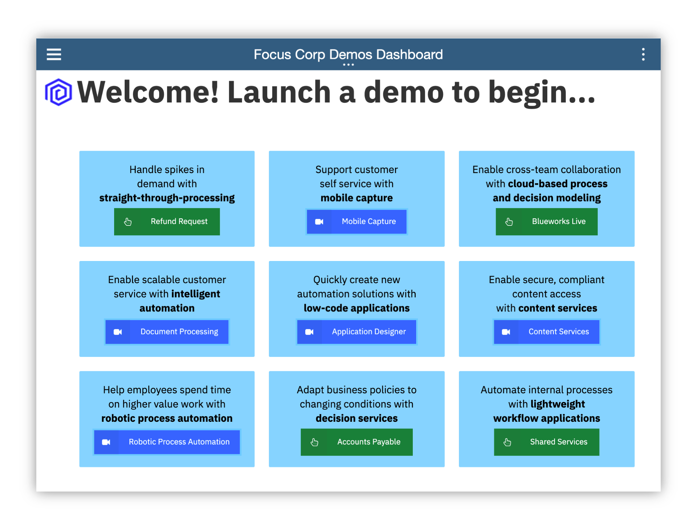

### an IBM Cloud Pak for Business Automation entry point

<AnchorLinks>
  <AnchorLink>Introduction</AnchorLink>
  <AnchorLink>Use Case Guided Tour</AnchorLink>
  <AnchorLink>Full Demo Narration</AnchorLink>
</AnchorLinks>

***

# Introduction

**Entry Point:** Automate internal processes with lightweight workflow applications

**Use Case Overview:** Working in a remote environment adds complexity to most tasks. Imagine you lead a shared services team and receive requests from other departments such as Accounts Payable or HR. In person, it's simple to collect information and share status. However, in a remote environment, organizing work is more challenging. Relying on email and phone is just not enough. Work can be duplicated or executed inconsistently, resulting in lost data and delays. You need a lightweight workflow to manage incoming requests.

**Choose an option:**

  * **Digital Business Automation on Cloud trial:** your environment is predeployed, continue to the [Guided Tour](#use-case-guided-tour) section below.
  * **Install Yourself:** To run Shared Services on your own environment you just need to install <a href="https://www.ibm.com/support/knowledgecenter/SSYHZ8_20.0.x/com.ibm.dba.workstream/topics/con_rwf_intro.html" target="_blank">IBM Automation Workstream Services</a>, there are no additional artifacts to deploy.

 

***

# Use Case Guided Tour

## Are you ready to accelerate activities in your daily work?

1 - Scenario Introduction - Shared Services

<Row>
<Column colLg={5} colMd={5}>

**Demo Video**

<ArticleCard
    color="dark"
    title="Demo Video - Shared Services Request"
    subTitle="In this demo, you will learn how to use lightweight workflows to manage incoming requests"
    href="https://ibm.biz/cp4ba-shared-services-video"
    actionIcon="arrowRight"
    color="dark"
    >

</ArticleCard>
</Column>
<Column colLg={7} colMd={7}>

**Demo Outline**

[Full Demo Narration](#full-demo-narration)

1. Use Case Overview
1. Focus Corp Demo Dashboard review
1. Workstream Supervisor persona
    1. Workplace Tour
    1. Manage Workstream teams
    1. Create workstream
    1. Test workstream
    1. Publish workstream
1. Use case review and value of lightweight workflow applications

 

</Column>
</Row>
<Row>
<Column colLg={4} colMd={4}>

**Discovery Map**

 

</Column>
<Column colLg={6} colMd={6}>

 

</Column>
</Row>

[Go to top](#introduction) | [Go to Guided Tour](#use-case-guided-tour)

2 - Login to Your Digital Business Automation on Cloud Trial

 

Login to your Digital Business Automation on Cloud trial <a href="http://automationcloud.ibm.com" target="_blank">here</a> to access your portal.

 

Don't have a trial yet? <a href="https://www.ibm.com/account/reg/us-en/signup?formid=urx-45706" target="_blank">Sign up</a> to get started or learn more about installing <a href="https://www.ibm.com/support/knowledgecenter/SSYHZ8_20.0.x/com.ibm.dba.workstream/topics/con_rwf_intro.html" target="_blank">IBM Automation Workstream Services</a> on your own platform.

 

[Go to top](#introduction) | [Go to Guided Tour](#use-case-guided-tour)

3 - Setup Your Trial SaaS Environment

 

First time in your trial environment?  Here are some recommended setup steps to get the best experience!

### IMPORTANT - Assign Your Roles

 

You will need to make sure you have the correct roles to use the environment.

1. Open the menu in the upper left.
1. Under **Administer subscriptions**, click **Access management**.
1. Locate or search for your user and ensure all environments (Development and so on) are activated.
1. Click the pencil icon on the right side of your user row and ensure at least the required roles are selected.
1. Optionally add all adinistrator roles as appropriate.

 

<Row>
<Column colLg={4} colMd={4}>

**Required Roles**

 

</Column>
<Column colLg={4} colMd={4}>

**All Administrator Roles**

 

</Column>
</Row>

### Setup your Process Portal

It is recommended to make the Focus Corp Demo Dashboard your default dashboard.

1. Log in to your **Process Portal** environment.
1. Under Dashboards click **Show more...** and click the icon next to **Focus Corp Demo Dashboard** and click the star icon.
1. Drag the right-side handle of that dashboard row to the top so this will load when you start Process Portal.

### Personalize your Process Portal

* Click the **Edit Profile** link in the upper left
* Add a picture
* Set notification settings as desired

 

[Go to top](#introduction) | [Go to Guided Tour](#use-case-guided-tour)

4 - Open the Focus Corp Demo Dashboard

1. Open the menu in the upper left
2. Select **Production** and then **Run**
3. Click the **Process Portal** tile
4. Wait for the portal to load in a new browser window/tab

 

5. On the left menu, under the **Dashboards**, click **Show more/less…**
6. Click **Focus Corp Demos Dashboard**
7. Wait for the dashboard to load on the right

 

Start by reviewing the available demos, they all represent an entry point to business automation so you can easily get started.
 

 

 

When ready, click the green **Shared Services** button to launch the demo.

 

[Go to top](#introduction) | [Go to Guided Tour](#use-case-guided-tour)

5 - Tour Workplace

#### Manage your work, don't let it manage you

 
You are now a manager leading a Shared Services team that receives requests from other departments such as Accounts Payable or HR for assistance.
As a Workplace Supervisor, you decide to create a lightweight workflow appllication to manage incoming requests and avoid a disorganized email inbox.

 

 

1. Check the tabs to learn more about the demo
    1. **Storyboard Outline**
    1. **Demo Discovery Map**

 

2. Navigate to the **Launch the Demo** tab and then click on the picture of the **Workstreams Supervisor**

 

3. Allow Workplace to fully load and then look around.  If no one has used Workplace yet, it might be empty similar to below

 

 

Once it is used, tasks and workflows will appear and the counters at the top will populate based on due date (**On track** and **Overdue**) and expected completion based on past performance (**At risk**). All views can be easily configured using built-in filter and search.

 

 

4. Click on the blue **Start workflow** button highlighted in red above and review the activities and workflows available to launch, but do not launch any yet.

 

 

5. When done, close the **Start workflow** dialog.

 

[Go to top](#introduction) | [Go to Guided Tour](#use-case-guided-tour)

6 - Manage workstream teams

 

To start using Workplace, you must first assign yourself, and any of your colleagues, a team; they control access to the Workplace environment.  You have administrative access previously set in **3 - Setup Your Trial SaaS Environment**, now let's add some Workstream teams.

 

1. Click the menu grid icon in the upper right corner and select **Manage workstream teams** (Note, if you do not see this menu option, close the menu, wait a few seconds and try again, or check the roles you set in **3 - Setup Your Trial SaaS Environment** above)

 

 

2. Click the radio button to the left of **Administrators** and wait for the right side list to load, which may be empty.

 

 

3. Click the plus sign in the right side to search for and add a new user to the team.  It is recommended to add yourself to **Administrators** and **Configurators** and optionally **Team managers**.

 

 

4. Optionally, create a new team named **Shared Services** and add yourself to represent assigning work to your team.
5. **IMPORTANT**: now that you have the correct teams set, refresh your browser window/tab to make the roles effective.
6. You will know once the role is effective when you click the menu grid icon in the upper right corner and see the following options.

 

 

[Go to top](#introduction) | [Go to Guided Tour](#use-case-guided-tour)

7 - Create a workstream

 

As a Supervisor, you are now ready to create a new workstream and publish it so the departments you work with, such as Accounts Payable and HR, can submit their requests in an organized manner.

 

1. Click the menu grid icon in the upper right corner and select **Create workstreams**

 

 

2. Review the workstreams provided with the platform as examples that you can keep or edit.
3. Once done reviewing, click the blue **New** button and configure your definition as pictured below, then click **Next** when ready.

 

> NOTE: selecting **All users** will allow any user in the system to submit a new request to your team; this could also be restricted to a team that you create, if desired.

 

4. Review the workstream editor:
    1. Your workflow will show vertically on the left.
    1. The currently selected activity in your workflow is configurable on the right.
    1. A draft can be saved at any time
    1. The Save button will place the workflow in trial mode for testers to try out.

 

 

 

5. Name the first activity **Skill profile** and select **Checklist** as the type.
6. Scroll down on the right side to configure your workflow's first activity
    1. Add some checklist items.
    1. Select **Allow users to update the checklist at start** (it might make sense to use placeholders as depicted below).
    1. Select to add data items and click the plus sign to add new data followed by selecting each of them to add them to this activity.
    1. Click **Who is responsible for this activity** and choose either **Shared Services**, if you created that optional team and added yourself, or **All users**.  Note, if you leave this screen to go check the teams, be sure to save a draft first.

 

 

 

 

 

 

7. When you are ready to create your second activity, click the plus icon at the bottom or you can also click the plus icon in the left side vertical workflow diagram.
8. Name the second activity **Approve Resource** and select **Approval** as the type.  This creates a two-way branch in the flow.

 

 

9. Click the plus sign next to **If approved** to add a third activity for that branch.
10. Name the third activity **Approval Notification** and select **Form** as the type.  Optionally add some data to send back and select Read only.

 

 

11. In the left diagram, click **Approve Resource** to select it, then click the plus sign next to **If rejected** to add a fourth and final activity for the other approval branch.
12. Name the fourth activity **Denial Notification** and select **Form** as the type.  Optionally add the data as Read only.
13. You may wish to change the **Who is responsible for this activity** selection and set the two notification activities to **The user who starts the workstream** and/or the approval activity to **Team managers** (just make sure you are a member of the selected team).
14. When complete, scroll to the top and click the blue **Save** button to put the workflow in trial mode

 

 

### Congratulations, you created your first lightweight workflow!

 

[Go to top](#introduction) | [Go to Guided Tour](#use-case-guided-tour)

8 - Test the workstream

 

It is time to test your new workstream. There is a built in Testers group that allows you to delegate this role but for now, let us test ourselves.

 

1. You should be at the **Create workstreams** screen but if you are not, click the menu grid icon in the upper right corner and select **Create workstreams**.
2. Locate the new workstream you just created and click the three-dot menu on the right, then select **Test**.

 

 

3. The initialization screen is specific to this workflow; read the instructions and scroll down to customize the checklist available to you as the workflow starter.

 

 

4. Once ready, scroll to the top right and click the blue **Start workstream** button.
5. To run the first task, click the menu grid icon in the upper right corner and select **Workplace**
6. You should see a **Skill profile** task in the list, click the name and claim it.

> Note: if you do not see the task in the list, you can either click the magnifying glass and search for **skill** or click the browser refresh button.  The task list may not refresh automatically in some browsers so searching should be faster than a full refresh.

 

 

You are now a shared services resource on the team you lead, selecting a request to confirm your skill profile.

 

7. Check off the items in the checklist, fill in the data fields, optionally upload a document or picture to include securely in the request, optionally add a comment and submit the task.

 

 

8. Back at the task list, search for **Approve Resource** as needed and claim the task.

 

 

You are now the shared services team manager again, time to approve or decline the request.

 

9. Review the approval screen, note the data is read-only by default and the comments from the previous task are present.
10. Either **Reject** or **Approve** the request.

 

 

You will now take on the role of the submitter/requestor such as Accounts Payable.

 

11. Search for **Notification** as needed and claim the task.

 

 

12. Review the notification, including the data and comments.
13. When done, click **Complete** at the upper right.

 

 

[Go to top](#introduction) | [Go to Guided Tour](#use-case-guided-tour)

9 - Publish the workstream

 

After testing, you are ready to publish your new workflow.

 

1. Click the menu grid icon in the upper right corner and select **Create workstreams**
2. Locate the new workstream you just created and click the three-dot menu on the right, then select **Request publish**.

 

 

The system has a built-in workflow for approving and publishing: a workstream for publishing workstreams!

 

3. Choose to **Assign to any publisher** and click **Assign**

 

 

You should see the workflow now in the **Published requested** status.

 

 

4. Click the menu grid icon in the upper right corner and select **Workplace**.
5. Locate or search for the task titled **Workstream review...** and click to claim it.

 

 

6. Review the workstream and note the **Read-only** notice next to the name.
7. Once you are done, click to **Publish** the workflow.

 

 

8. Click **Start workflow** and locate the just published workflow to launch.

 

### In just a few minutes, you created, tested and published a new, lightweight workflow available to anyone in your organization!

 

[Go to top](#introduction) | [Go to Guided Tour](#use-case-guided-tour)

11 - Summary

 

As you saw, Workstream Services helps you manage remote work more effectively by allowing business users to create lightweight workflows that automate internal processes, no coding required. Get ready to improve your team's productivity by simplifying common tasks and decreasing the complexity and limitations of remote work.

 

[Go to top](#introduction) | [Go to Guided Tour](#use-case-guided-tour)

***

 
 

# Full Demo Narration

#### Intro

Working in a remote environment adds complexity to most tasks.  Imagine you lead a shared services team and receive requests from other departments such as Accounts Payable or HR. In person, it's simple to collect information and share status.

However, in a remote environment, organizing work is more challenging.  Relying on email and phone is just not enough. Work can be duplicated or executed inconsistently, resulting in lost data and delays.  You need a lightweight workflow to manage incoming requests.

#### Demo Start Page

After reviewing the demo launch page including the outline and discovery map, we are ready to launch the Line of Business Supervisor's Workplace interface, the single place you manage all your work.

#### Manage workstream teams

You check out the start workflow list and see great starting activities and workflows such as approval, checklist and more.

You start by managing the teams.  It's a good idea to add yourself to at least Administrators and Supervisors and maybe Team managers.  You can also create a Shared Services team so you can assign work to them later.

#### Create a workstream

Now it's time to create a workstream for incoming shared services requests.  We'll set it so everyone can start and give a description.  The simple, no-code editor allows you to assemble a workflow in just a few clicks.  Start with a checklist activity to represent the skill profile requested.  To make this reusable, we add checklist items with placeholders and allow the user that launches the flow to update and add more.  Let's also add a couple data items for the country and date available.  Once the request is submitted, the shared services team member will complete this form and confirm their skills.  Your first activity is complete!

We add another step to get manager approval and setup a simple branch flow.  For the approval branch we add a form to notify of the result.  Then, head back to our approval and add the rejection branch.  So simple!  To complete the workstream, we save and we're ready to go.

#### Test a workstream

The new flow starts in trial mode for the author or a testing group to try it out safely before the end users.  Simple to test, we see the launch screen specific to this workstream where the user starting the flow, such as an Accounts Payable clerk, will configure available options including checklist items, and also any activity assignments allowed by the workstream, which we did not activate yet.

Once started, we go back to the main Workplace.  Let's take on the role of a shared services team member and see how easy it is to complete the first step. Claim and open the task, check the checklist items, fill in the data, optionally attach a document for review, type a comment and submit.  This is much easier and more organized than email.  Now taking on my team manager role for approval, all looks good and I accept.  Finally, the original requestor receives an approval notification to complete the request. Back at the task list we can switch to workflows and without any customization, the tool provides a complete audit trail of all work by default.

#### Publish a workstream

Once ready, I can request a publish to share my workstream with other teams.  The platform has a built in approval workstream for workstreams!  So we head to the same task list, click to review the workstream definition.  As a publisher, I may send it back with comments or publish directly.  And in just a few minutes, I created, tested and published a new, lightweight workflow available to anyone in my organization: ready to launch!

#### Use Case Summary

As you saw, Workstream Services helps you manage remote work more effectively by allowing business users to create lightweight workflows that automate internal processes, no coding required. Get ready to improve your team's productivity by simplifying common tasks and decreasing the complexity and limitations of remote work.

 

[Go to top](#introduction) | [Go to Guided Tour](#use-case-guided-tour)
