## Accounts Payable
**an IBM Cloud Pak for Business Automation use case**
***

# Introduction

**Use Case Overview:** Today, your accounts process is entirely manual, with the amount of invoices only increasing. When first capturing an invoice, you must enter the invoice data into multiple systems. From there, different people must validate the invoice data and match the invoice to the Purchase Order. This results in data entry errors and inconsistencies across multiple systems. After all these steps, you can finally process payment in the ERP system. In this demo, you will learn how to adapt business policies to changing conditions with business rules.

**Choose an option:**

  * **Cloud Pak for Business Automation as a Service demo environment (predeployed for IBMers only):** continue to the [Getting Started Lab](#getting-started-lab) section below.
  * **Install Yourself:** To deploy Accounts Payable on your own environment, and technical architecture information, see the <a href="https://github.com/ibm-cloud-architecture/dba-accounts-payable.git" target="_blank">dba-accounts-payable</a> git repository which includes the required deployment artifacts.

 

***

# Getting Started Lab

**Are you ready to see flexible business decisions in action?**

## 1. Scenario Introduction - Accounts Payable

??? note summary "Expand to view"
    **Demo Video**

    In this demo, you will learn how to adapt business policies to changing conditions with business rules

    

    ??? note summary "Demo Outline"
        **Demo Outline**

        [Full Demo Narration](#full-demo-narration)

        1. Use Case Overview
        1. Focus Corp Demo Dashboard review
        1. Customer persona
            1. Submit rejected invoice
            1. Turn on decision labels, fix $0 and submit approved
            1. Submit invoice that should be rejected, but is approved
        1. Operations Specialist persona
            1. Week 1 dashboard
        1. Rule Manager persona
            1. Decision model review
            1. Review $0 total amount text rule and Validate PO Against Supplier table
            1. Create new branch
            1. Add a new row in the table for IN / Inc scenario
            1. Validate
            1. Simulate rules and compare with original simulation report
            1. Deploy new version
        1. Customer persona
            1. Turn on new rule version
            1. Same invoice is correctly rejected
        1. Operations Specialist persona
            1. Week 2 dashboard
        1. Use case review and value of decision services

    ??? note summary "Discovery Map"
        

    [Go to top](#lab-section-1) | [Go to Getting Start Lab](#getting-started-lab)

## 2. Login and Setup Your Environment

??? note summary "Expand to view"

    **Select an option for your environment**

    ??? note summary "Option 2A - Using a Cloud Pak for Business Automation as a Service environment (predeployed for IBMers only) ?"

        

        IBM maintains multiple internal SaaS tenants for IBMers only.

        Please login to IBM Technology Zone and navigate to <a href="https://techzone.ibm.com/collection/5fdfcf8b99cf35001ee4954d" target="_blank">here</a> to learn about these **demo environments** via the **User Guide**.

        1\. Once you have access to an environment, please continue here:  
        &nbsp; &nbsp; &nbsp; • &nbsp; Enablement Users, this demo is not available on enablement tenants at this time.  
        &nbsp; &nbsp; &nbsp; • &nbsp; Demo Users, once your account administrator completes the below setup and provides you access, please continue.  
        &nbsp; &nbsp; &nbsp; • &nbsp; Administrator Users, please reference the <a href="https://techzone.ibm.com/collection/business-automation-saas#tab-2" target="_blank">Administration Guide</a> (IBM only) for any additional setup information including onboarding users.  
        &nbsp; &nbsp; &nbsp; &nbsp; &nbsp; &nbsp; > Note: Navigate to the **Demo tenants** tab after login.

        2\. Login to your Cloud Pak for Business Automation as a Service demo environment <a href="http://automationcloud.ibm.com" target="_blank">here</a> to access your portal.

        3\. Open the menu in the upper left.

        4\. Select **Production** and then **Run**.

        5\. Click the **Business Automation Apps** tile

        6\. Wait for the Business Automation Apps to load in a new browser window/tab

         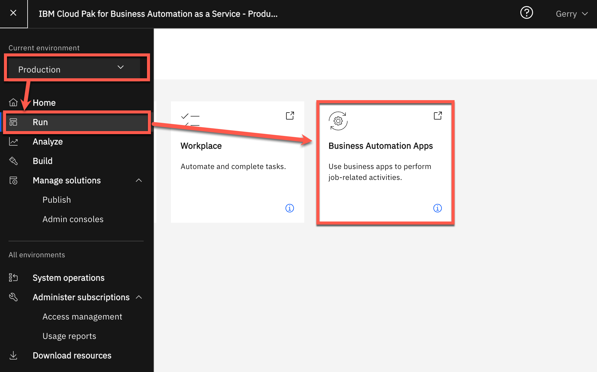

        7\. Click the **Accounts Payable** tile

        [Go to top (Option 2a)](#lab-section-2a) | [Go to Getting Start Lab](#getting-started-lab)

    ??? note summary "Option 2B - Are You Using Your Own Environment (not a SaaS demo) ?"
        

        1\. Standard Users, once your account administrator completes the below setup and provides you access, please continue.

        2\. Administrator Users, expand the following section to access additional information to setup access for yourself and others in your environment:

        ??? note summary "Additional Administrator Setup For Your Own Environment"

            See the <a href="https://github.com/ibm-cloud-architecture/dba-accounts-payable.git" target="_blank">dba-accounts-payable</a> git repository to deploy on your own platform.

        > Standard Users, continue here...

        3\. Ask your administrator for the Process Portal URL and your login credentials

        4\. Select **Production** and then **Run**.

        5\. Click the **Business Automation Apps** tile

        6\. Wait for the Business Automation Apps to load in a new browser window/tab

          

        [Go to top (Option 2b)](#lab-section-2b) | [Go to Getting Started Lab](#getting-started-lab)

    [Go to top](#lab-section-2) | [Go to Getting Started Lab](#getting-started-lab)

## 3\. Submit invoices and review results from business rules
??? note summary "Expand to view"

    #### Be your customer!

     
    You are now a customer with an invoice to submit for payment and you want to make sure it is valid.  What do you experience?
    As a customer, you want to be paid for your services on time and make sure you are doing your part to submit valid invoice data.  Clear and consistent business rules ensure you know what you need to do.

     

    1. Check the tabs to learn more about the demo
        1. **Storyboard Outline**
        1. **Discovery Map**

     

    2\. Navigate to the **Run the Demo** tab and then click on the picture of the **Customer**

     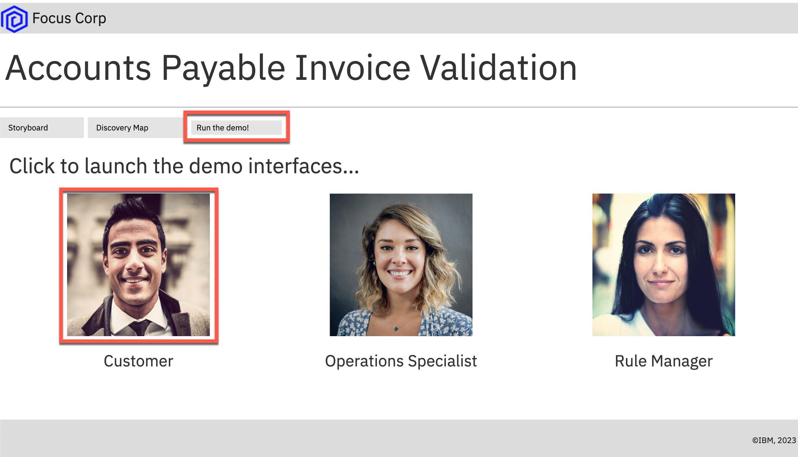

    3\. Use the drop down to select the first invoice ending in **101R**.

    > NOTE: invoices ending in R should be rejected and A should be approved

     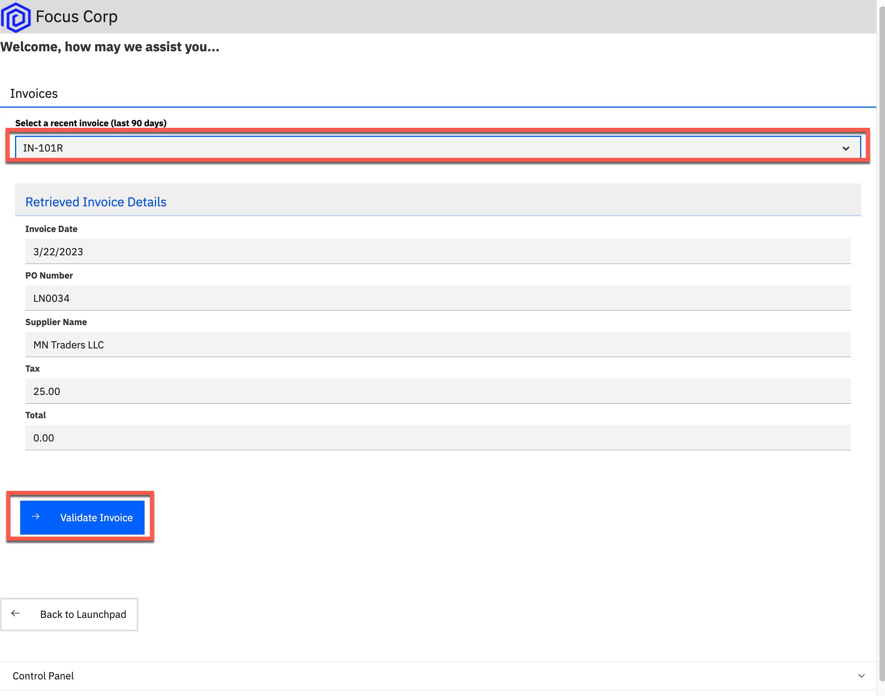

    4\. Click **Validate Invoice** to see the results, the invoice is rejected

    5\. Choose to **Submit Another Invoice**

    6\. Select the invoice ending in **105R**

    7\. Submit the invoice and see that it is not rejected as expected which leads to rework in downstream business processes, we will examine the rules for this invoice in detail so make a note of the invoice information we'll assess in the business rules

    

    [Go to top](#introduction) | [Go to Getting Start Lab](#getting-started-lab)

## 4\. Review the Operations Dashboard
??? note summary "Expand to view"

    
    You are now a Focus Corp employee, first an Operations Specialist and later a Rule Manager. First, lets review the operations dashboards

    1\. Navigate back to the main Accounts Payable App and click on the picture of the Operations Specialist

    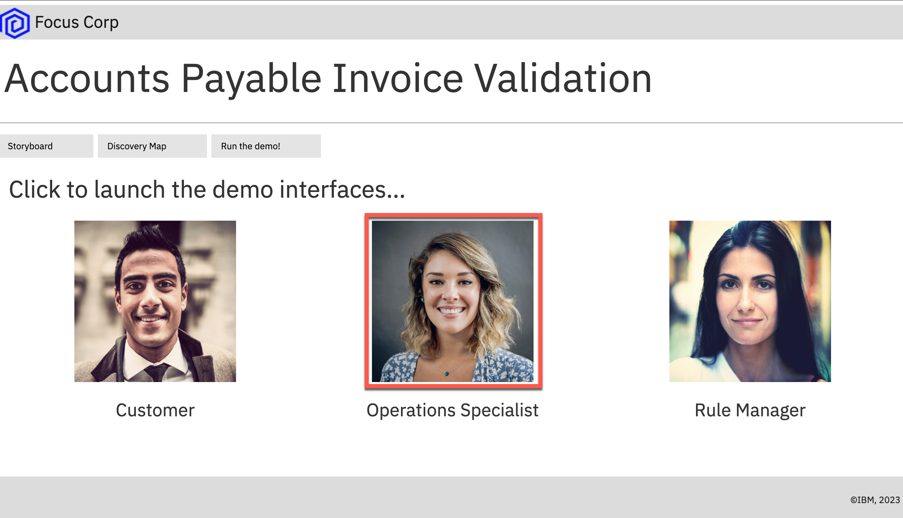

    2\. Find the **Accounts Payable(AP) Week 1** dasboard in the list and click to open it

    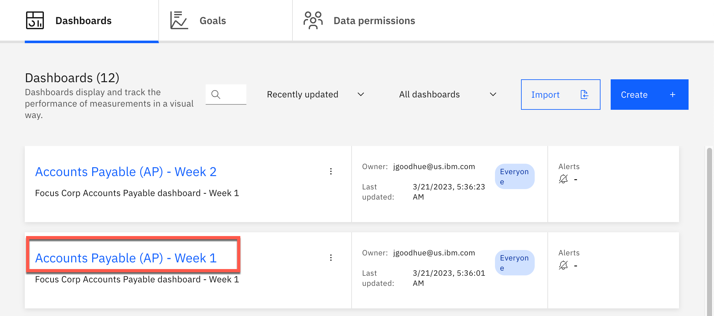

    3\. The Week 1 dashboard will open

    

    4\. Review the Week 1 dashboard metrics and note the following:

    1. Average invoice processing time is unmanageable at above 100 minutes
    1. The rules deviated from the final result on more than 60 invoices this week

       [Go to top](#introduction) | [Go to Getting Start Lab](#getting-started-lab)

## 5\. Review the business rules
??? note summary "Expand to view"

    **Continuing as the Focus Corp Rule Manager, how can you adapt your rules to reduce rework and process invoices faster with less exceptions?**

    Rule Managers can adjust rules, validate and simulate the decision service and deploy quickly and easily. Navigate back to the main Accounts Payable App and click on the picture of the Rule Manager

    

    This launches Decision Center, an application used by rule managers to create, update and manage their business rules.

    1. Enter "Validate Invoice" into the filter text box and then click on the decision service **Validate Invoice Service**
    

    1. Click on **main** to open the main branch decision model
    

    1. Click on **Types** to open type selction window.
    

    1. Click on **Ruleflows** then click the **Apply** button. This will display the ruleflow.
    

    1. Review the ruleflow, processing starts by setting default values, then execution splits into two tasks, Amount and Supplier. Each task contains a single rule.
    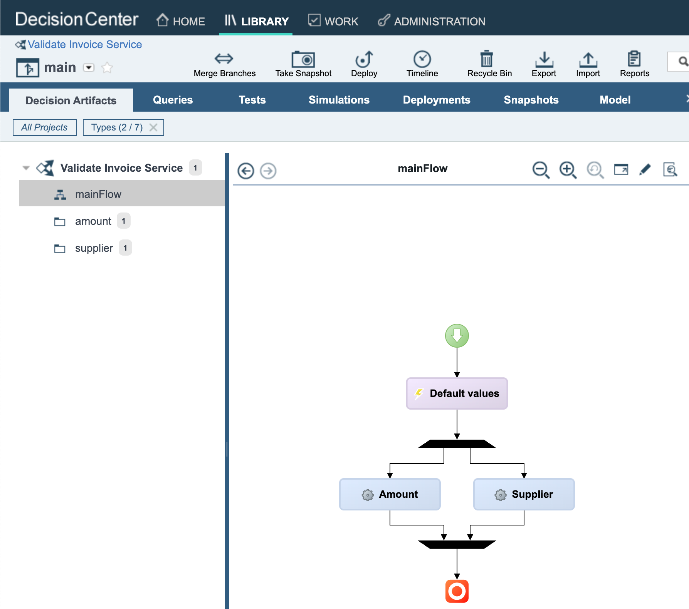

    5\. Click the **amount** folder on the left then click on the **$0 Total Amount** rule. Read through the rule so you are familiar with its logic.
    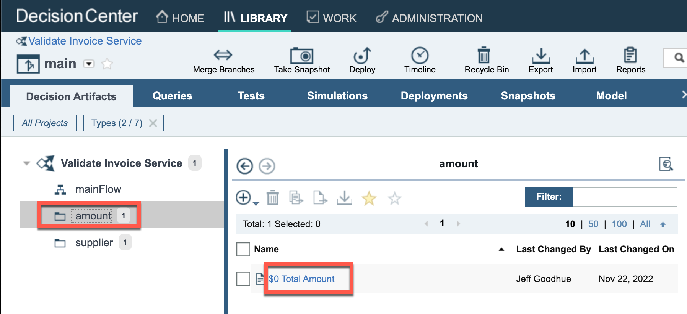

    6\. Click the **supplier** folder on the left then click on the **Validate PO against supplier** rule to open the decision table. 
    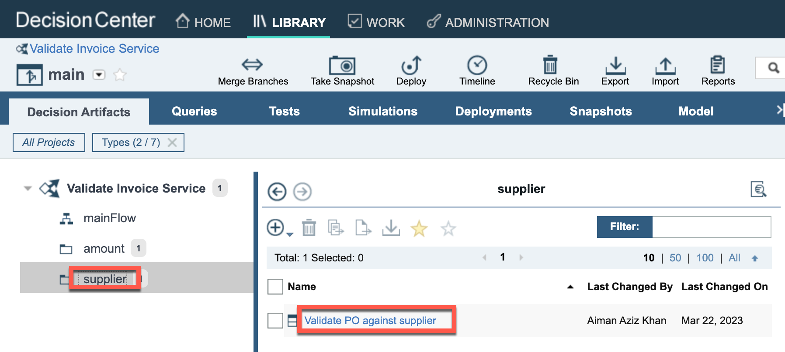

    7\. Review the decision table and note there are six rows, there is no row addressing Inc. suppliers. 
    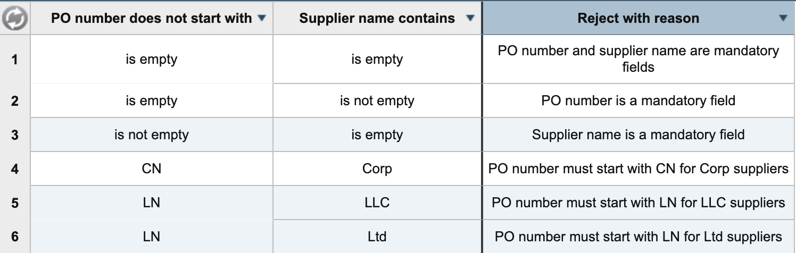

    If the decision table already contains a row dealing with Inc suppliers then someone has made an update on the main branch. We will describe how to reset this rule back to its starting state in the Cleanup section.

    [Go to top](#introduction) | [Go to Getting Start Lab](#getting-started-lab)

## 6\. Update and simulate the business rules
??? note summary "Expand to view"

    1\. At the upper left, click **Validate Invoice Service**
    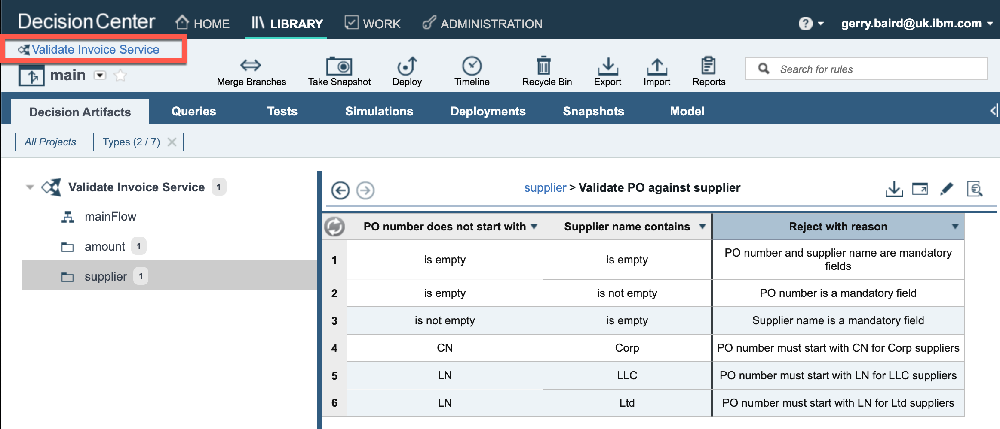

    2\. Make sure you are in the **Branches** tab  and just above **main**, click the plus icon to create a new branch name using a unique phrase such as your name, ensure **main** is the parent branch and click **Create**

     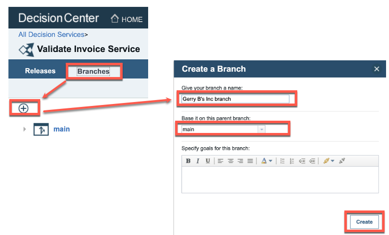

    **If the decision table discussed below already contains a row dealing with Inc suppliers then someone has made an update on the main branch, please refer to the instructions in the cleanup section to restore an earlier version of this rule before proceeding.**

    3\. Click the **supplier** folder and then hover over the rule called **Validate PO against supplier** and click the **pencil** icon to open the rule for editing.

    

    4\. Right click on the last row and select **Insert row** -> **Below**

    

    7\. Enter values in the new row to look for **IN** when suppliers are **Inc** type as pictured. Ensure the message is entered exactly as shown **PO number must start with IN for Inc suppliers**

    

    > NOTE: you can copy and paste cells as you would in a spreadsheet editor

    8\. On the upper right, click the **Save** icon, provide a comment and click **create new verison**

    

    9\. In the full lifecycle, a Rule Manager runs test suites before deploying the rules, click **Tests** in the menu bar and click the **run** icon on the Test Suite. 

    

    10\. The updated rules will be deployed and the test scenario will run, once it has completed open the report and review the results.

    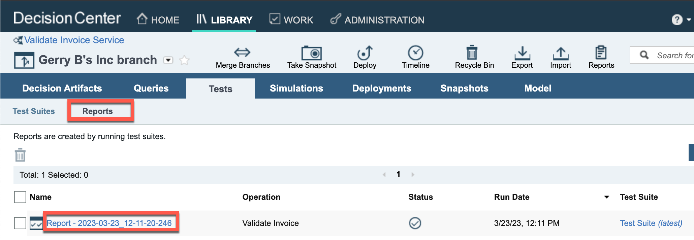

    11\.If you created the new rule correctly the test report should show no errors.

    

    If you wish, go back to the **Test Suite** tab and open the Test Suite for editing.  

    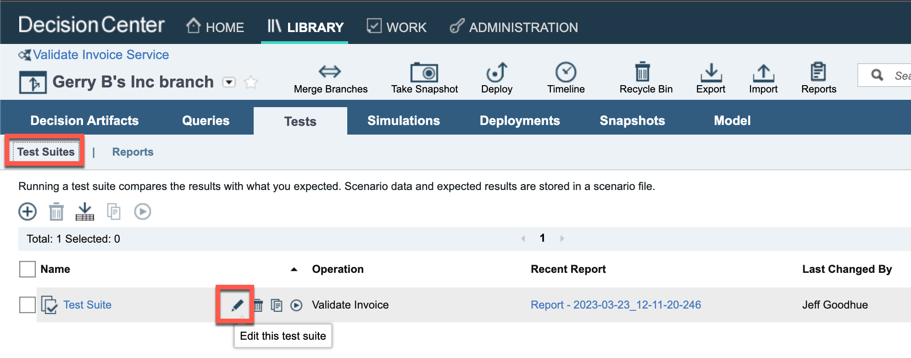

    You can also download the scenario Excel file and see how the test is performed by looking at the scenarios worksheet and the expected results worksheet.

    12\. Click the **Simulations** tab and **Simulations** sub tab. Place the mouse over the **Accounts Payable Simulation** and click the run icon.

    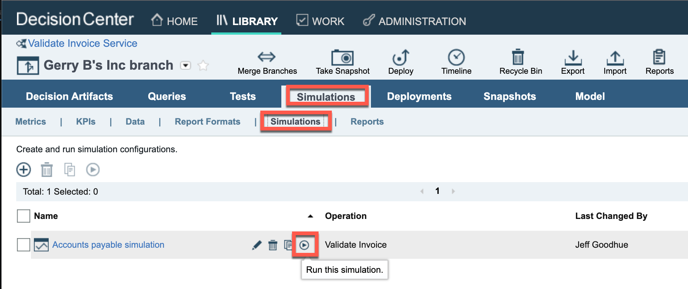

    13\. After clicking **OK**, you will see the simulation running with a spinning status icon

    14\. Once a checkmark appears, place the mouse over the report name and click the compare icon on the right

    

    13\. Under **main**, select the simulation report that is furthest in the past and click compare

    

    On the left are the results for the new rules and the right are the results for the original rules

    14\. Compare and notice some important differences:

    1. (pie chart) more invoices were rejected (the new rule rejects a new incorrect pattern)
    1. (orange bar chart) higher value invoices are rejected more

    

    [Go to top](#introduction) | [Go to Getting Start Lab](#getting-started-lab)

## 7\. Deploy the business rules and see the results
??? note summary "Expand to view"

    1. Click the **Deployments** tab and **Configurations** sub tab
    2. Place the mouse over **Validate Invoice Production Deployment** and click the deploy icon on the right

    

    3. Review the deployment details and click **Deploy**, take a note of the new version that will be created as a result of this deployment.
    4. Once a checkmark appears, click the name of the deployment report to open it and take note of the number under **New Version** at the bottom (such as **1.3**)

    5. Navigate back to the Accounts Payable  browser window/tab and click on the picture of the **Customer**

    

    6. Select the same invoice that was accepted earlier, ending in **105R**

    7. At the bottom, expand the **Control Panel** and activate the **Upgrade rules scenario**

    8. In the **Your ruleset version** field that appears, enter the version you deployed (such as **1.3**) and click Validate Invoice

    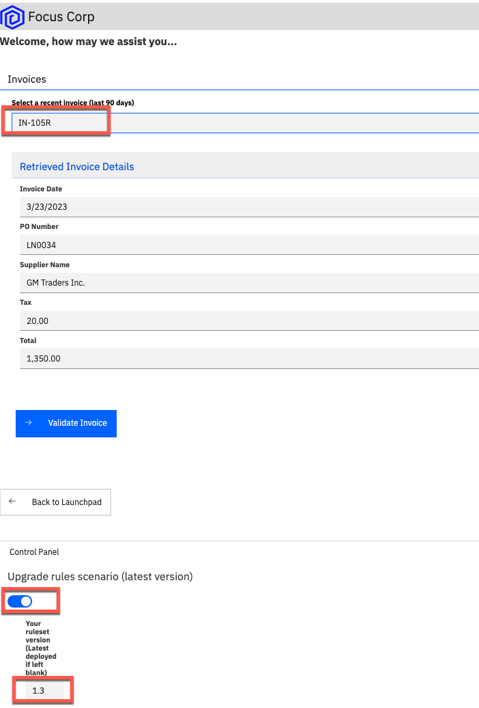

    9. Confirm the invoice is rejected with the reason code from your new rule table row

    

    10. Click **Back to Launchpad**

    [Go to top](#introduction) | [Go to Getting Start Lab](#getting-started-lab)

## 8\. Review latest operational performance
??? note summary "Expand to view"

    1. Navigate back to the **Focus Corp Demos Dashboard** browser window/tab
    2. Click on the picture of the **Operations Specialist**
    3. Open the **Accounts Payable(AP) - Week 2** dashboard and note the following:
        1. Lower average invoice processing time below 100 minutes
        1. Less deviation from the final result per week

    **The upgraded rules are reducing rework already!**

     

    [Go to top](#refund-request-automation) | [Go to Getting Start Lab](#getting-started-lab)

## 9\. Summary
??? note summary "Expand to view"

    We just used decision automation, a capability within IBM Cloud Pak for Automation, to automate an accounts payable process.  With growing volumes of invoices, business rule automation helps reduce the amount of human intervention for account processing, detect issues earlier, and incorporate changes quickly when needed.

    [Go to top](#introduction) | [Go to Getting Start Lab](#getting-started-lab)

***

## 10\. Cleanup and Reset
??? note summary "Expand to view"

    When you create your own branch you are helping to keep your work seperate from the main branch. However, there is a possibility that someone has made their updates to the main branch.
    If this happens your new branch will have the update rule already. The simple fix for this is revert the rule back to an earlier version. 

    1. Open the **Validate PO aginst supplier** decision table, this is typically the only rule that is updated. 

    

    2. Confirm that the table already has a row for **IN Inc** invoices and click the icon to expand the window.

    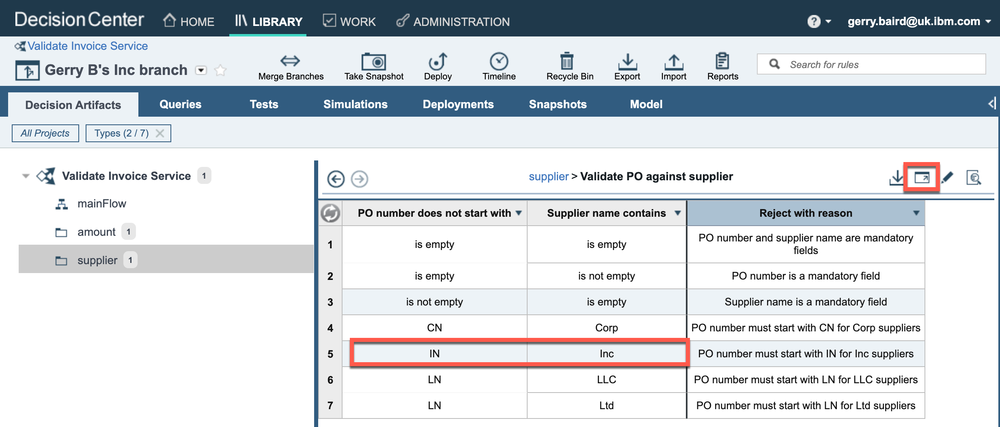

    3. Open the timeline view for this rule 

    

    4. Browse through the history of the rule until you find an earlier version with just 6 rows, that doesn't contain the new row. Just click on the card to open a specific version.

    

    3. If the rule contains the new row just go back to the timeline by clicking on the **Timeline** icon again and select another version. 
    If the rule does not contain the new row click the **Restore** icon, and then the **Restore Version** button.

    

    Your rules should now be back at the starting state. It would be helpful to others if you could do the same restoration to the main branch. 
    Just switch over to the main branch using the arrow near your branch name, once you've updated the main branch remember to switch back to your branch.

    Finally, please remove your branch. Click on **Validate Invoice Service** in the top left corner, select your branch, then select **Delete**

    

    [Go to top](#introduction) | [Go to Getting Start Lab](#getting-started-lab)

***

# Full Demo Narration

??? note summary "Expand to view"
    **Demo Narration and Flow**

    **Demo Start Page**

    Reviewing the demo launch page we see a text summary describing the demo and a discovery map diagram for our reference.  We will only focus on the Validate Invoice Data step in the flow.  OK, let's launch the demo.

    **Customer invoice submissions**

    We start by becoming the customer.  From the Focus Corp Accounts Payable Invoices portal, we select an invoice ending with R (therefore it should be rejected) and submit for rule validation.  We review five key data fields extracted from the invoice using intelligent document processing and then submit for validation.  This invoice is rejected by the business rules as the total amount must be greater than 0.

    Let's resubmit that invoice by fixing the total amount to $100 and see what the rules say.  We can also take a look at the fields that the business rules use to make their decision.  And this time, the corrected invoice is accepted and passes rule validation.

    We have various other invoices to try, let's select another one ending in R that should be rejected, but this time the rules do not find an issue and it is accepted.  This type of result means more rework in downstream business processes as humans are involved in more review and the invoice is routed back and forth to be fixed.

    **Operations week 1**

    Further, we can see from the Operations Specialist's week 1 dashboard that the average invoice processing time in the upper right is unmanageable at above 100 minutes.  Further, the rules deviated from the final result on more than 60 invoices this week, adding to rework. Rules must change at the speed of the changing business so let's see how we can improve the business rules.

    **Rules manager**

    As a rules manager, we have access to the invoice validation decision model. The ruleflow orchestrates the decision making process using a text rule to check the total amount is more than $0 which resulted in our first invoice being rejected.  A decision table looks for combinations of PO numbers and supplier types that do not follow the correct pattern (update!).  This is where the second invoice should have be rejected but the table is missing a new invalid pattern.

    The rules manager, a business user, edits the decision model, adds a new row, easily does a copy/paste of the existing row to get a head start, exactly like a spreadsheet, adjusts the values to match the new Inc. based rejection pattern and the rule is ready.  Tables automatically generate multiple text rules that follow the same pattern so we do not have to write them all from scratch.

    Let's validate our work by running the test suite to confirm the business logic is now correct.

    Now we'll move beyond functional testing and onto simulation. After running a new simulation and comparing side by side, the business can make an informed decision about the impact of new rules before ever deploying to production.  Yes, this looks as expected so we are ready to deploy.  In this case, the business can deploy on their own but this can be configured for only certain safe rules and others must go through IT testing.

    **Customer approved to rejected**

    After the rules manager deploys the new rules, we go back to the invoice submission and choose the same invoice that should now be rejected.  We see the invalid pattern of PO number and supplier type and we select in the demo control panel to upgrade to the latest rule version.  The results, rejected with the reason code deployed by the business rule manager.

    **Operations week 2**

    After these new rules are in place for a week, the Operations Specialist reviews their updated dashboard and sees solid improvement with a reduction of average invoice processing time from less invoice rework and also less deviation between the rules and the final invoice decision.  Our rules are more accurate.

    **Use Case Summary**

    We just used decision automation, a capability within IBM Cloud Pak for Automation, to automate an accounts payable process.  With growing volumes of invoices, business rule automation helps reduce the amount of human intervention for account processing, detect issues earlier, and incorporate changes quickly when needed.

    [Go to top](#video-narration) | [Go to Getting Started Lab](#getting-started-lab) | [Go to Introduction](#introduction)

