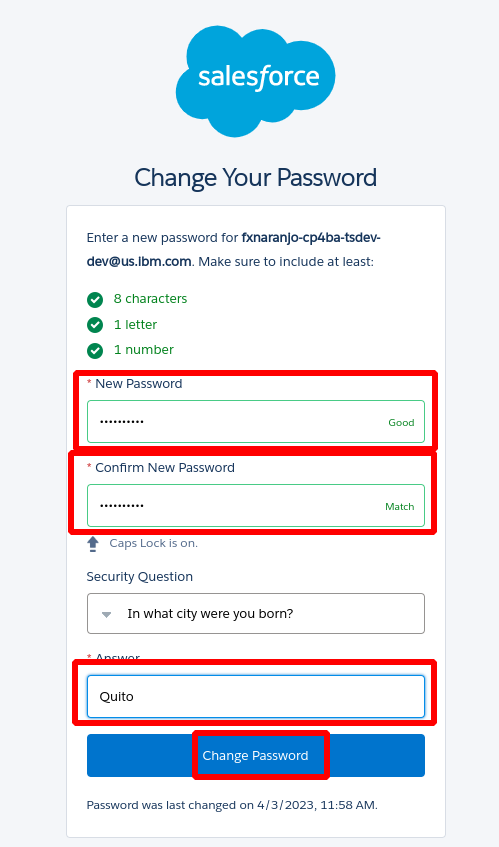

## Connect Salesforce CRM Content to FileNet
**an IBM Cloud Pak for Business Automation use case**
***

# Introduction

**Use Case:** Connect Salesforce CRM Content to FileNet

**Use Case Overview:** Focus Corp recently acquired a subscription to Salesforce CRM as part of their strategy to drive sales opportunities and client relationships, documents such as contracts, meeting notes, invoices, etc , needed to be associated to client accounts or opportunities as part of their day by day operations. You will assume the role of Chad, a Sales Specialist employee at Focus Corp. Chad will seamlessly connect Salesforce with FileNet Content Manager to eliminate a content silo and manage Salesforce content within the leading, modern FileNet Content Manager platform. This native integration allows Salesforce users to store and manage related content seamlessly in FileNet Content Manager as it relates to Salesforce accounts, cases, opportunities, and more. They will no longer need to switch applications to find related information. With a Salesforce-oriented user experience, this connector will require minimal to no training, and IT teams can take advantage of the feature-rich content management capabilities of FileNet and govern enterprise content in one place.

The IBM FileNet Content Services GraphQL API provides the connection between the IBM FileNet Connector for Salesforce app and the IBM FileNet Content Engine server. The following graphic describes this connection:

The FileNet Salesforce Connector App connects to the IBM FileNet Content Services GraphQL API through a secure HTTPS connection. The GraphQL API then makes calls to the Content Platform Engine server through the Content Engine Java API to interact with Documents and with SalesforceRelationship objects that associate Documents with Salesforce records.

Note that while all query and data retrieval operations are made from the Connector App running within a Salesforce.com server, there are two operations where the user’s browser will connect directly to the Content Services GraphQL API server. This direct communication occurs only for document upload and download operations.

**Environment Access:**

**Choose an option:**

* Cloud Pak for Business Automation as a Service demo environment (likely an IBMer or Business Partner): your environment is predeployed, continue to the [Getting Started Lab](#getting-started-lab) Lab section below. This option includes a Salesforce environment that is already configured to access IBM FileNet. 

* Install Yourself: To deploy Salesforce Connector on your own environment, and technical architecture information, see the <a href="https://github.com/ibm-cloud-architecture/dba-connect-salesforce" target="_blank">dba-connect-salesforce</a> git repository which includes the required deployment artifacts.
 
***

# Getting Started Lab

## 0. General Info

??? note summary "Expand to view icons used throughout this lab"
    | Icon   | Description                                   |
    | :----- | :-------------------------------------------- |
    | ℹ️     | **Informational note**                        |
    | ⚠️      | **Warning note**                              |
    | ⚙️      | **Sections identified with a ﹡ indicates that the section may require deeper technical expertise and should be skipped by non-technical users** |

## 1. Scenario Introduction

??? note SUMMARY "Expand to view"

    **Use Case Overview**

    Sales Specialist (Chad Jones) needs to create a new Salesforce Account for a customer. As part of the process he needs to attach several documentation to the account for auditing and tracking . This documentation have several properties that need to be added as document metadata in the IBM FileNet Content Manager Repository. The document properties are often updated by sales representatives as well as the version of the documents. Being able to view , download and delete associated documents is crucial so Chad can  manage the required account documentation from one single place instead of using multiple user interfaces.

    **Discovery Map**

    

    ***Value for the business***    

    **Business users**

    * Up to date information without duplication
    * Content accessible without switching applications
    * No file size or storage limitations

    **IT administrators**

    * Eliminate content silos with consistent and advanced governance and records management across applications
    * Automate relationships for new and existing documents with Salesforce objects
    * Utilize optimized storage in FileNet

    [Go to top](#lab-section-1) | [Go to Getting Started Lab](#getting-started-lab)

## 2. Login and Setup Your Environment

??? note summary "Expand to view"

    ??? note summary "Option 2A - Using a Cloud Pak for Business Automation as a Service environment (likely an IBMer or Business Partner) ?"
        

        IBM maintains multiple SaaS tenants that can be reserved and accessed by both IBMers and Business Partners.

        Please login to IBM Technology Zone and navigate to <a href="https://techzone.ibm.com/collection/5fdfcf8b99cf35001ee4954d" target="_blank">here</a> to reserve an environment.

        1. Once you have access to an environment, please continue here:

            • Enablement Users, the Connect Salesforce use case will be available 2023 H2.

            • Demo Users, once your account administrator completes the below setup and provides you access with the base environment, additionally request access to the Salesforce environment.

            • Administrator Users, please reference the Administration Guide (IBM only) for any additional setup information including onboarding users.

        **Salesforce is a customer relationship management (CRM) platform. It helps marketing, sales, commerce, service and IT teams work as one from anywhere and collaborate to progress sales opportunities and handle the relationship with clients.**

        2\. One you request access to the Salesforce environment, you will receive an email to activate your account, go ahead a click "Verify Account"

            

        3\. You will be asked to change your password

         

        4\. Once you change your password you will be redirected to the Salesforce home page
    
         

        [Go to top (Option 2A)](#lab-section-2a) | [Go to Getting Started Lab](#getting-started-lab)

    ??? note summary "Option 2B - Are You Using Your Own Environment (not a Cloud trial/demo) ?"
        
            1\. Standard Users, once your account administrator completes the below setup and provides you access, please continue.

        2\. Administrator Users, expand the following section to access additional information to setup access for yourself and others in your environment:

        ??? note summary "Additional Administrator Setup For Your Own Environment"

            Administrator must have a Salesforce environment to been able to configure the connector to FileNet.

            Go to <a href="https://developer.salesforce.com/signup" target="_blank">Salesforce Developers</a> . Follow the prompts on the Salesforce pages to get your free developer account.

            See the <a href="https://github.com/ibm-cloud-architecture/dba-connect-salesforce" target="_blank">dba-connect-salesforce</a> git repository to configure the connector.

        > Standard Users, continue here...

        > Please continue to the [next](#lab-section-3) section

        [Go to top (Option 2B)](#lab-section-2b) | [Go to Getting Started Lab](#getting-started-lab)

    [Go to top](#lab-section-2a) | [Go to Getting Started Lab](#getting-started-lab)

## 3. Setting up the FileNet Salesforce application

??? note SUMMARY "Expand to view"

    You are now a Sales Specialist employee at Focus Corp, Chad, at Focus Corp creating a new Customer for handling sales opportunities and client relationship . As an Sales Specialist, Chad will use the Salesforce web user interface to create a new account and associate relevant documentation for auditing and tracking. The documentation have properties that will help you identify it in the future, you will also need to view and update this documents from the Salesforce web page.

    Let's get started

    1\. Access the IBM FileNet Salesforce Application 

    In the Salesforce menu search for "IBM FileNet" and then click over the "IBM FileNet Salesforce Connector" application
    
     

    2\. Create a new Account in Salesforce

    In the "IBM FileNet Salesforce Connector" Application menu click "Accounts" and then "New" button to create a new Account
    
     

    3\. Complete the new Account information in Salesforce

    In the "New Account" window complete the following properties and click "Save":

    * Account Name: TestAcount(Username)
    * Type: Customer
    * Industry: Communications
    * Employees: 25
    * Annual Revenue: 5'000.000
    
     

    4\. You will be redirected to the "TestAcount" account page, there is a widget called "Related Documents" which is the one that provides the IBM FileNet integration, as it is a new company the list of documents should be empty.
    
     

    [Go to top](#lab-section-3) | [Go to Getting Started Lab](#getting-started-lab)

## 4. Adding and Viewing Documents

??? note SUMMARY "Expand to view"

    1\. Now you will upload some example documents to the account, you can use the folowing files:

    * [Map Example](./sample-documents/Image.jpg)
    * [Meeting Notes](./sample-documents/Meeting%20Notes%201-30-2023.docx)
    * [Brochure](./sample-documents/WSD14120USEN.pdf)

    Use the following table to upload the 3 documents to the account:

    Name | Filename | Document Class      | Account Name
    ------- | ---------------- | ---------- | ---------:
    Map Example  | Image.jpg | SF Document | TestAccount(Francisco)
    Meeting Notes  | Meeting Notes 1-30-2023.docx        | SF CRM Document       | TestAccount(Francisco)
    Brochure   | WSD14120USEN.pdf | SF Document      | TestAccount(Francisco)

    Use the next screen as reference for document uploading:

    

    After uploading the files your "Related Documents" widget should look like this

    

    2\. Once the documents are uploaded you can View/Edit the related properties

    Click in the icon menu of the "Brochure" document then click on properties

    

    The document properties are displayed, you can even change some property value or view "System Properties" and "Versions"
  
    

    3\. You can also view the documents in the Salesforce User Interface, document formats such as pdf or jpeg will be displayed

    Click in the icon menu of the "Brochure" document then click on view

    

    The document content is displayed

     

    [Go to top](#lab-section-4) | [Go to Getting Started Lab](#getting-started-lab)

## 5. Updating Documents

??? note SUMMARY "Expand to view"

    1\. You can update a new version of a document using the user interface by using the icon menu of the "Brochure" document then click on "Upload New Version"

     

     In the next screen you should select the new file to upload and click "Upload"

     

    [Go to top](#lab-section-5) | [Go to Getting Started Lab](#getting-started-lab)

## 6. Downloading Documents

??? note SUMMARY "Expand to view"

     1\. To Dowload a document use the icon menu of the "Brochure" document then click on "Download"

     

    [Go to top](#lab-section-6) | [Go to Getting Started Lab](#getting-started-lab)

## 7. Deleting Documents 

??? note SUMMARY "Expand to view"

     1\. To Delete a document use the icon menu of the "Brochure" document then click on "Remove from Record"

     

      Confirm the document deletion in the following dialog

     

     The widget should show the updated list of documents

     

    [Go to top](#lab-section-7) | [Go to Getting Started Lab](#getting-started-lab)

## 8. Summary

??? note SUMMARY "Expand to view"

    As you saw, FileNet Salesforce Connector enables secure and compliant IBM FileNet content access through the use of the Salesforce web user interface, uploading viewing and editing documents and associate them with Salesforce records within one single user interface greatlly improve the accesibility needed by users to execute their daily tasks.

    ***Value for the business***    

    **Business users**

    * Up to date information without duplication
    * Content accessible without switching applications
    * No file size or storage limitations

    **IT administrators**

    * Eliminate content silos with consistent and advanced governance and records management across applications
    * Automate relationships for new and existing documents with Salesforce objects
    * Utilize optimized storage in FileNet

    ***Solves a variety of use cases across industries***

    * Back-office employees digitize documents that are automatically associated with a Salesforce account so that front-office employees have access to the most up to date information while interacting with customers.

    * Banking advisors saving documents about their clients in Salesforce to provide informed customer experiences, but store and govern those documents in FileNet.

    * Share content across sales and service groups to provide a single source of truth while maintaining a single content repository.

    * Managing complaints within Salesforce, but storing the relevant documentation in FileNet.

    * Keep sensitive healthcare documents in FileNet while accessing them seamlessly in Salesforce.

    * B2B new merchant onboarding where the merchant is being tracked as an opportunity in Salesforce and sends in documents to be stored within the opportunity in FileNet.

    
    [Go to top](#lab-section-8) | [Go to Getting Started Lab](#getting-started-lab)

## 9. Troubleshooting

??? note SUMMARY "Expand to view"

    1\. Using Salesforce UI 
    
    Chrome/Firefox are the recommended browsers to display the document viewer and work with documents from the Accounts Tab. 

    [Go to top](#lab-section-9) | [Go to Getting Started Lab](#getting-started-lab)

***

# Additional Assets

**Optional - additional assets to explore**

## 100. GraphQL

??? note SUMMARY "Expand to view"
    Video: <a href="https://ibm.biz/SimplifyDevelopmentFileNetGraphQL" target="_blank">Simplify Development using the FileNet GraphQL API (7:18)</a>

    

    The FileNet GraphQL API enables you to query and manipulate data easily through an intuitive and flexible syntax that simplifies application development for your Content Platform Engine. The API allows you to request the exact information you need and receive predictable results reducing the number of network calls and bandwidth requirements improving performance.

    The following document provides reference information for developers who want to use the Content Services GraphQL API in a FileNet Content Manager container environment.

    [Content Services GraphQL API Developer Guide](./guides/GraphQL_API_Developer.pdf)

    [Go to top](#additional-assets) | [Go to Introduction](#introduction) | [Go to Getting Started Lab](#getting-started-lab)

## 101. Salesforce Integration

??? note SUMMARY "Expand to view"
    Video: <a href="https://ibm.biz/FileNetSalesforce" target="_blank">Salesforce CRM Content to FileNet (6:29)</a>

    

    Seamlessly connect Salesforce with FileNet Content Manager to eliminate a content silo and manage Salesforce content within the leading, modern FileNet Content Manager platform. This native integration allows Salesforce users to store and manage related content seamlessly in FileNet Content Manager as it relates to Salesforce accounts, cases, opportunities, and more. They will no longer need to switch applications to find related information. With a Salesforce-oriented user experience, this connector will require minimal to no training, and IT teams can take advantage of the feature-rich content management capabilities of FileNet and govern enterprise content in one place.

    [Go to top](#additional-assets) | [Go to Introduction](#introduction) | [Go to Getting Started Lab](#getting-started-lab)
